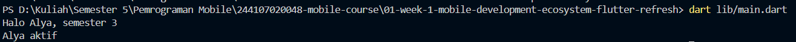
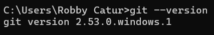
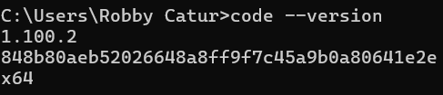
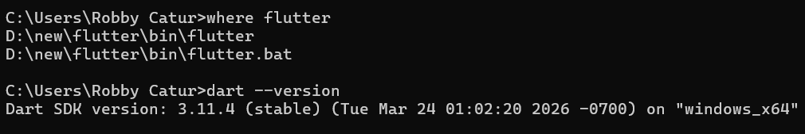
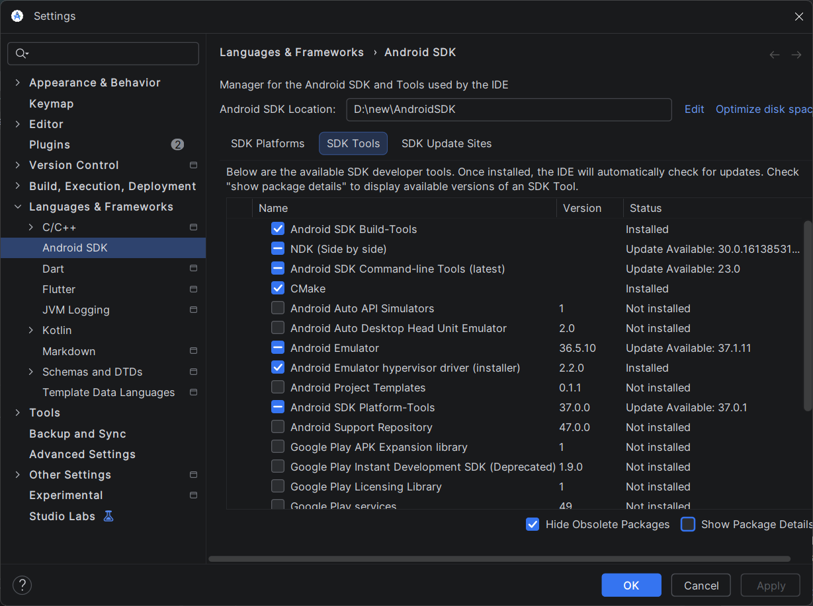
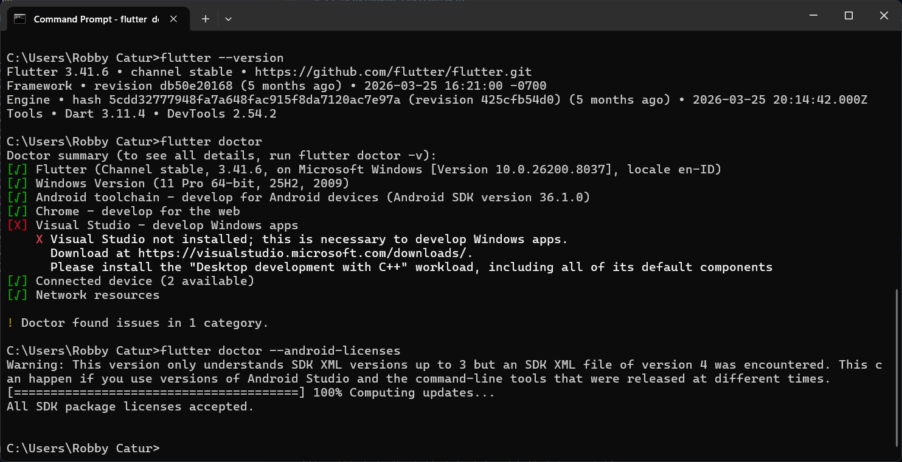
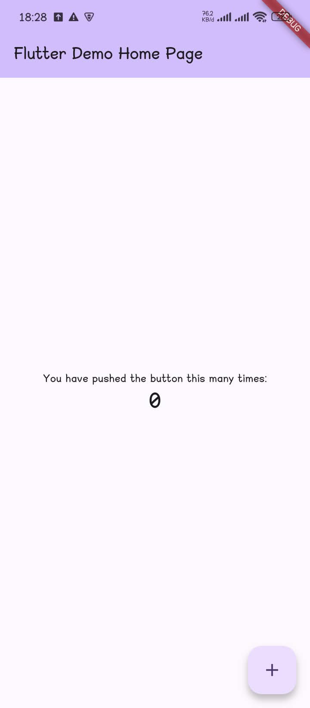
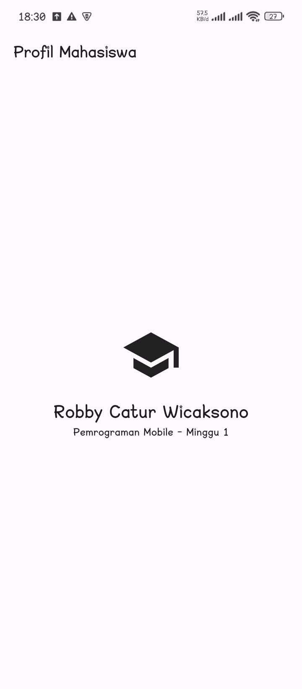

| Key | Value |
|------|-----------------------|
| Nama | Robby Catur Wicaksono |
| NIM | 244107060014 |
| Kelas | TI - 3H |
| Mata Kuliah | Pemrograman Mobile |

# 1. Dart Refresh

Dart adalah bahasa bertipe statis dengan inferensi tipe. Gunakan tipe eksplisit ketika membantu keterbacaan dan final untuk nilai yang hanya diinisialisasi sekali.

Kode Program : 

```dart
void main() {
  String nama = 'Alya';
  int semester = 3;
  final bool aktif = true;
  print(sapa(nama, semester));
  final mahasiswa = Mahasiswa(nama: nama, aktif: aktif);
  print(mahasiswa.status());
}

String sapa(String nama, int semester) => 'Halo $nama, semester $semester';

class Mahasiswa {
  Mahasiswa({required this.nama, required this.aktif});
  final String nama;
  final bool aktif;
  String status() => aktif ? '$nama aktif' : '$nama tidak aktif';
}
```

Hasil: 



# 2. Menyiapkan Environtment

## Instalasi dan verifikasi

1. Instal Git dari git-scm.com, lalu jalankan git --version.



2. Instal VS Code dan ekstensi Flutter (Dart ikut terpasang).



3. Instal Flutter SDK mengikuti panduan resmi; tambahkan flutter/bin ke PATH.



4. Instal Android Studio beserta Android SDK, Command-line Tools, dan emulator melalui SDK Manager serta Device Manager.



5. Buka terminal baru dan jalankan perintah berikut.

```bash
flutter --version
flutter doctor
flutter doctor --android-licenses
```



# 3. Praktikum: aplikasi Flutter pertama

## 1. Membuat dan menjalankan proyek

Buka terminal pada folder kerja, lalu jalankan:

```bash
flutter create my_first_app
cd my_first_app
flutter run
```
Hasil run:



Pilih emulator atau perangkat fisik bila diminta. Setelah aplikasi contoh tampil, tekan `r` di terminal untuk hot reload atau `R` untuk hot restart.

## 2. Mengubah UI default

Buka lib/main.dart, ganti isinya dengan kode berikut, simpan, dan amati hot reload.

```dart
import 'package:flutter/material.dart';

void main() => runApp(const MyApp());

class MyApp extends StatelessWidget {
  const MyApp({super.key});
  @override
  Widget build(BuildContext context) {
    return MaterialApp(
      debugShowCheckedModeBanner: false,
      home: Scaffold(
        appBar: AppBar(title: const Text('Profil Mahasiswa')),
        body: const Center(
          child: Column(mainAxisSize: MainAxisSize.min, children: [
            Icon(Icons.school, size: 72),
            SizedBox(height: 16),
            Text('Nama Anda', style: TextStyle(fontSize: 24)),
            Text('Pemrograman Mobile — Minggu 1'),
          ]),
        ),
      ),
    );
  }
}
```

Ganti Nama Anda dengan nama sendiri. Ubah ikon atau teks sekali, lalu bandingkan hasil hot reload dan hot restart.

Hasil: 



# 4. Git dan portfolio

Di dalam folder my_first_app, konfigurasikan identitas Git bila belum pernah dilakukan dan buat commit awal:

```bash
git config --global user.name "Nama Anda"
git config --global user.email "email@contoh.com"
git init
git add .
git commit -m "feat: create week 1 Flutter profile app"
```


Buat repository kosong di GitHub atau GitLab (tanpa README awal jika sudah ada lokal), lalu hubungkan dan unggah commit (nim ganti dengan NIM Anda):

```bash
git branch -M main
git remote add origin https://github.com/USERNAME/nim-mobile-course.git
git push -u origin main
```