| Key | Value |
|------|-----------------------|
| Nama | Robby Catur Wicaksono |
| NIM | 244107060014 |
| Kelas | TI - 3H |
| Mata Kuliah | Pemrograman Mobile |

# 1. Praktikum: layout sederhana (warm-up)

Sebelum dashboard responsif, latih dulu widget dasar dengan membuat kartu profil sederhana. Buat project baru atau ganti sementara isi `lib/main.dart`:

Kode Program : 

```dart
import 'package:flutter/material.dart';

void main() => runApp(const ProfileApp());

class ProfileApp extends StatelessWidget {
  const ProfileApp({super.key});

  @override
  Widget build(BuildContext context) {
    return const MaterialApp(
      debugShowCheckedModeBanner: false,
      home: Scaffold(
        body: Center(child: ProfileCard()),
      ),
    );
  }
}

class ProfileCard extends StatelessWidget {
  const ProfileCard({super.key});

  @override
  Widget build(BuildContext context) {
    return Container(
      width: 320,
      padding: const EdgeInsets.all(16),
      decoration: BoxDecoration(
        color: Colors.indigo.shade50,
        borderRadius: BorderRadius.circular(16),
      ),
      child: Column(
        mainAxisSize: MainAxisSize.min,
        children: [
          Row(
            children: [
              const CircleAvatar(child: Icon(Icons.person)),
              const SizedBox(width: 12),
              Expanded(
                child: Column(
                  crossAxisAlignment: CrossAxisAlignment.start,
                  children: const [
                    Text('Nama Mahasiswa',
                        style: TextStyle(fontWeight: FontWeight.bold)),
                    Text('Robby Catur Wicaksono'),
                  ],
                ),
              ),
            ],
          ),
          const SizedBox(height: 12),
          const Row(children: [
            Expanded(child: Text('NIM')),
            Text('244107020048'),
          ]),
          const Row(children: [
            Expanded(child: Text('Kelas')),
            Text('TI-3H'),
          ]),
        ],
      ),
    );
  }
}
```

Hasil: 

<div style="display: flex; gap: 16px;">
  <figure style="margin: 0; text-align: center;">
    <figcaption><strong>5 Inch</strong></figcaption>
    
  </figure>
  <figure style="margin: 0; text-align: center;">
    <figcaption><strong>10 Inch</strong></figcaption>
    
  </figure>
</div>

### Penjelasan

- 5 Inch (ponsel): layar sempit, kartu 320px hampir memenuhi lebar layar, margin kiri-kanan tipis.
- 10 Inch (tablet): layar lebar, kartu tetap 320px sehingga di-center dengan ruang kosong besar di kiri dan kanan
- Perbedaan ini disebabkan oleh kode `width: 320` yang mengunci lebar kartu tetap berukuran 320px tanpa melihat ukuran device pengguna

## Eksperimen warm-up
1. Hapus Expanded pada baris nama, lalu amati peringatan overflow atau perilaku layout-nya; kembalikan setelah itu.

<div style="display: flex; gap: 16px;">
  <figure style="margin: 0; text-align: center;">
    <figcaption><strong>5 Inch</strong></figcaption>
    
  </figure>
  <figure style="margin: 0; text-align: center;">
    <figcaption><strong>10 Inch</strong></figcaption>
    
  </figure>
</div>

**Penjelasan:**
Pada gambar, terlihat bahwa teks keluar dari Row yang sudah disiapkan, bahkan melebihi dari ukuran layar. Overflow terjadi karena saat Expanded dihapus, Column nama dibiarkan memakai lebar aslinya sehingga begitu teksnya terlalu panjang melebihi sisa ruang Row, Flutter tidak bisa menyusutkannya dan teks keluar dari batas.

Setelah `Expanded` dikembalikan

<div style="display: flex; gap: 16px;">
  <figure style="margin: 0; text-align: center;">
    <figcaption><strong>5 Inch</strong></figcaption>
    
  </figure>
  <figure style="margin: 0; text-align: center;">
    <figcaption><strong>10 Inch</strong></figcaption>
    
  </figure>
</div>

**Penjelasan:**
Teks sekarang sudah tidak keluar dari row yang sudah disiapkan karena ada `Expanded` sehingga `Flutter` bisa menyusutkan teks tersebut mengikuti ukuran `Row` yang sudah disiapkan

2. Ganti mainAxisSize: MainAxisSize.min menjadi nilai default dan amati perubahan tinggi kartu.

<div style="display: flex; gap: 16px;">
  <figure style="margin: 0; text-align: center;">
    <figcaption><strong>5 Inch</strong></figcaption>
    
  </figure>
  <figure style="margin: 0; text-align: center;">
    <figcaption><strong>10 Inch</strong></figcaption>
    
  </figure>
</div>

**Penjelasan:**

- `MainAxisSize.min`: Column hanya setinggi isinya, sehingga kartu profil pendek/ringkas (sesuai tinggi teks + avatar).
- `MainAxisSize.max`: Column mengisi seluruh ruang vertikal pada layar, sehingga kartu memanjang mengikuti tinggi layar dengan konten tetap di bagian atas.

3. Tambahkan satu baris data (misal Email) menggunakan pola Row + Expanded yang sama.

<div style="display: flex; gap: 16px;">
  <figure style="margin: 0; text-align: center;">
    <figcaption><strong>5 Inch</strong></figcaption>
    
  </figure>
  <figure style="margin: 0; text-align: center;">
    <figcaption><strong>10 Inch</strong></figcaption>
    
  </figure>
</div>

**Penjelasan:**
Membuat satu baris data baru menggunakan pola Row dan Expanded yang sama dengan yang sebelumnya, masih dalam satu baris yang sama dengan NIM dan Kelas.

# 2. Praktikum: dashboard responsif

Buka `lib/main.dart`. Buat aplikasi profil sederhana berikut, lalu jalankan pada emulator atau perangkat fisik.

```dart
import 'package:flutter/material.dart';

void main() => runApp(const DashboardApp());

class DashboardApp extends StatelessWidget {
  const DashboardApp({super.key});

  @override
  Widget build(BuildContext context) {
    return MaterialApp(
      debugShowCheckedModeBanner: false,
      theme: ThemeData(useMaterial3: true, colorSchemeSeed: Colors.indigo),
      darkTheme: ThemeData(useMaterial3: true, brightness: Brightness.dark, colorSchemeSeed: Colors.indigo),
      themeMode: ThemeMode.system,
      home: const DashboardPage(),
    );
  }
}

class DashboardPage extends StatelessWidget {
  const DashboardPage({super.key});

  @override
  Widget build(BuildContext context) {
    return Scaffold(
      appBar: AppBar(title: const Text('Student Dashboard')),
      body: LayoutBuilder(
        builder: (context, constraints) {
          final columns = constraints.maxWidth >= 700 ? 2 : 1;
          return GridView.count(
            padding: const EdgeInsets.all(16),
            crossAxisCount: columns,
            crossAxisSpacing: 16,
            mainAxisSpacing: 16,
            childAspectRatio: 2.6,
            children: const [
              DashboardCard(title: 'Assignments', value: '8'),
              DashboardCard(title: 'Attendance', value: '92%'),
              DashboardCard(title: 'Portfolio', value: 'Ready'),
              DashboardCard(title: 'Current week', value: '02'),
            ],
          );
        },
      ),
    );
  }
}

class DashboardCard extends StatelessWidget {
  const DashboardCard({required this.title, required this.value, super.key});
  final String title;
  final String value;

  @override
  Widget build(BuildContext context) {
    return Card(
      child: Padding(
        padding: const EdgeInsets.all(20),
        child: Row(children: [
          Expanded(child: Text(title)),
          Text(value, style: Theme.of(context).textTheme.headlineSmall),
        ]),
      ),
    );
  }
}
```

Hasil:

<div style="display: flex; gap: 16px;">
  <figure style="margin: 0; text-align: center;">
    <figcaption><strong>5 Inch</strong></figcaption>
    
  </figure>
  <figure style="margin: 0; text-align: center;">
    <figcaption><strong>10 Inch</strong></figcaption>
    
  </figure>
</div>

## Menambahkan interaksi: StatefulWidget dan Cupertino

Sejauh ini dashboard masih `StatelessWidget`. Ubah `DashboardApp` menjadi `StatefulWidget` dan tambahkan `CupertinoSwitch` (widget Cupertino) pada `AppBar` untuk mengganti tema secara manual — sekaligus membedakan komponen Material dan Cupertino secara langsung:

```dart
class DashboardApp extends StatefulWidget {
  const DashboardApp({super.key});

  @override
  State<DashboardApp> createState() => _DashboardAppState();
}

class _DashboardAppState extends State<DashboardApp> {
  bool isDark = false;

  @override
  Widget build(BuildContext context) {
    return MaterialApp(
      debugShowCheckedModeBanner: false,
      theme: ThemeData(useMaterial3: true, colorSchemeSeed: Colors.indigo),
      darkTheme: ThemeData(useMaterial3: true, brightness: Brightness.dark, colorSchemeSeed: Colors.indigo),
      themeMode: isDark ? ThemeMode.dark : ThemeMode.light,
      home: DashboardPage(
        isDark: isDark,
        onDarkChanged: (value) => setState(() => isDark = value),
      ),
    );
  }
}
```

Sesuaikan `DashboardPage` agar menerima state dan callback:

```dart
class DashboardPage extends StatelessWidget {
  const DashboardPage({
    required this.isDark,
    required this.onDarkChanged,
    super.key,
  });
  final bool isDark;
  final ValueChanged<bool> onDarkChanged;

  @override
  Widget build(BuildContext context) {
    return Scaffold(
      appBar: AppBar(
        title: const Text('Student Dashboard'),
        actions: [
          Row(
            children: [
              Icon(isDark ? Icons.dark_mode : Icons.light_mode),
              const SizedBox(width: 4),
              CupertinoSwitch(
                value: isDark,
                onChanged: onDarkChanged,
              ),
              const SizedBox(width: 12),
            ],
          ),
        ],
      ),
      body: LayoutBuilder(
        // ... kode GridView sebelumnya, tidak berubah
      ),
    );
  }
}
```

Hasil:

<div style="display: flex; gap: 16px;">
  <figure style="margin: 0; text-align: center;">
    <figcaption><strong>5 Inch</strong></figcaption>
    
  </figure>
  <figure style="margin: 0; text-align: center;">
    <figcaption><strong>10 Inch</strong></figcaption>
    
  </figure>
</div>

**Penjelasan:**
Widget yang dihasilkan oleh `Cupertino` memiliki tampilan khas Apple, yang berbeda dengan widget yang dihasilkan oleh `Material` yang memiliki gaya Android/Google. Di method `CupertinoSwitch`, `value` digunakan untuk menentukan posisi _switch_ atau _toggle_ dan `onChanged` meupakan _callback_ yang dipicu saat _toggle_ digeser.

<p style="background-color: #FEF7E0; border-left: solid 5px; border-radius: 10px; border-color: orange; padding: 10px">CupertinoSwitch berasal dari pustaka Cupertino — tambahkan import package:flutter/cupertino.dart; di bagian atas file. Bandingkan dengan Switch.adaptive milik Material yang otomatis menampilkan tampilan Cupertino di iOS.
</p>

**Tabel Hasil Perbandingan**

| Aspek | CupertinoSwitch | Switch.adaptive |
|-------|-----------------|-----------------|
| Asal | Paket flutter/cupertino.dart | Paket flutter/material.dart |
| Tampilan | Selalu gaya iOS di platform apa pun | Otomatis menyesuaikan (Cupertino di iOS, Material di Android/Web/Desktop) |
| Properti | value, onChanged | value, onChanged, plus activeColor, materialTapTargetSize, dll |
| Pemakaian | Saat aplikasi ingin tampilan persis iOS | Saat aplikasi ingin konsisten dengan konvensi tiap OS |

## Eksperimen Layout

1. Ubah breakpoint dari 700 menjadi nilai lain dan amati perubahan jumlah kolom.

```dart
// Perubahan untuk Dimensi 5 Inch
final columns = constraints.maxWidth >= 300 ? 2 : 1;

// Perubahan untuk DImensi 10 Inch
final columns = constraints.maxWidth >= 1500 ? 2 : 1;
```
**Penjelasan:**
Untuk 5 Inch, mengubah sebelumnya breakpoint 700 menjadi 300 yang menghasilkan 2 kolom yang berbeda (sebelumnya 1). Hal ini karena nilai dari `constraints.maxWidth` yaitu 300 lebih kecil daripada lebar dimensi ponsel itu sendiri, sehingga `constraonts.maxWidth >= 300` mengembalikan nilai `true`. Untuk 10 Inch, mengubah sebelumnya breakpoint 700 menjadi 1500 yang menghasilkan 1 kolom yang berbeda (sebelumnya 2). Hal ini karena nilai dari `constraints.maxWidth` yaitu 1500 lebih besar daripada lebar dimensi ponsel itu sendiri, sehingga `constraonts.maxWidth >= 1500` mengembalikan nilai `false` 

Hasil:

<div style="display: flex; gap: 16px;">
  <figure style="margin: 0; text-align: center;">
    <figcaption><strong>5 Inch</strong></figcaption>
    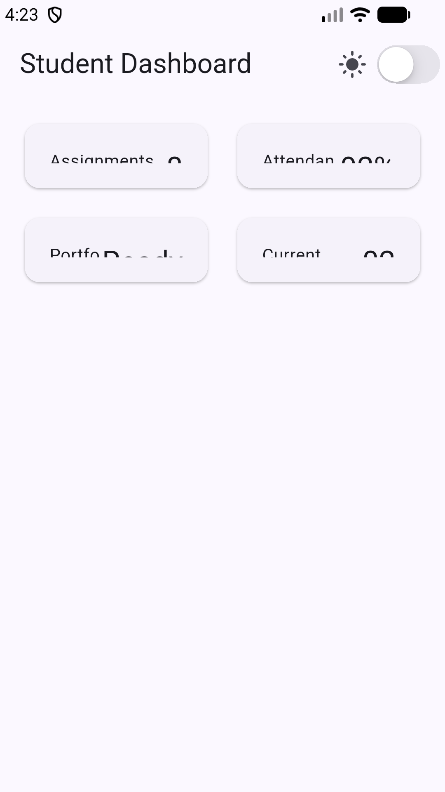
  </figure>
  <figure style="margin: 0; text-align: center;">
    <figcaption><strong>10 Inch</strong></figcaption>
    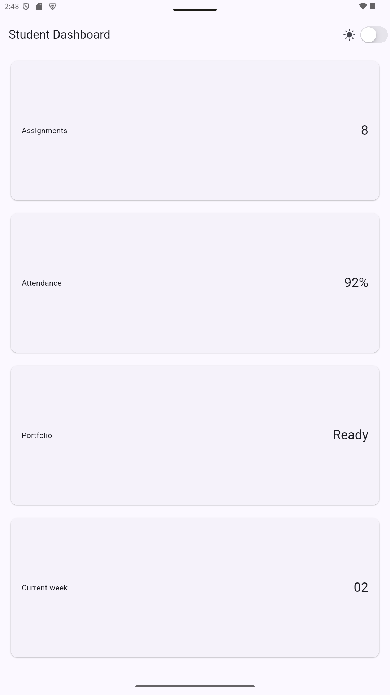
  </figure>
</div>

2. Ubah themeMode menjadi ThemeMode.dark, lalu kembalikan ke ThemeMode.system.

```dart
themeMode: ThemeMode.system,
```

Hasil:

<div style="display: flex; gap: 16px;">
  <figure style="margin: 0; text-align: center;">
    <figcaption><strong>5 Inch</strong></figcaption>
    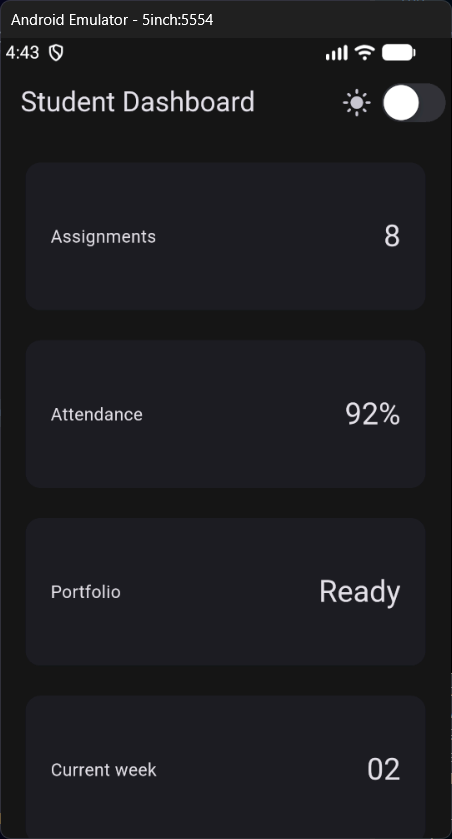
  </figure>
  <figure style="margin: 0; text-align: center;">
    <figcaption><strong>10 Inch</strong></figcaption>
    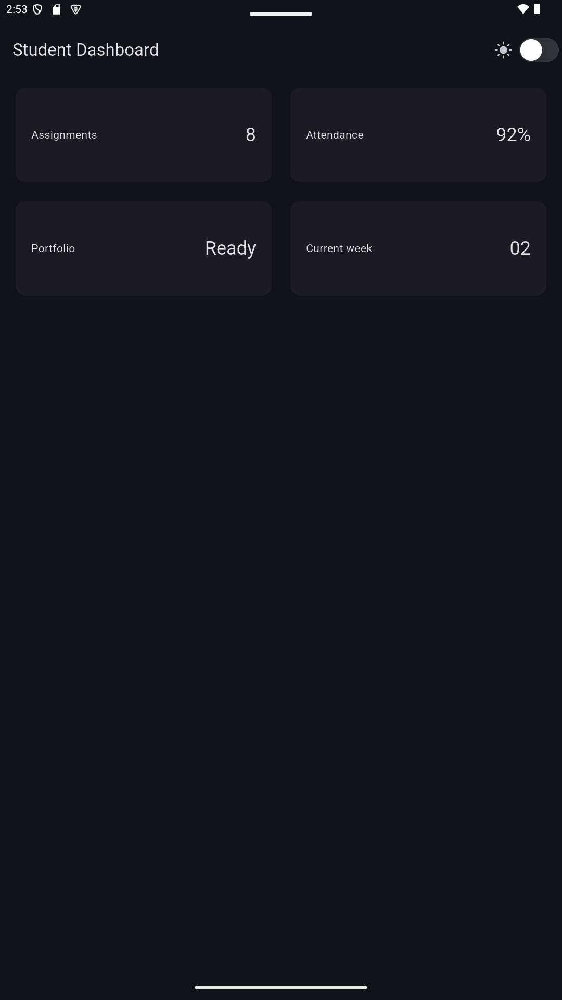
  </figure>
</div>

**Penjelasan:**
Aplikasi tetap menggunakan tema gelap, terlepas posisi _toggle_ sedang dalam _light mode_ atau _dark mode_

```dart
themeMode: ThemeMode.system,
```

<div style="display: flex; gap: 16px;">
  <figure style="margin: 0; text-align: center;">
    <figcaption><strong>5 Inch</strong></figcaption>
    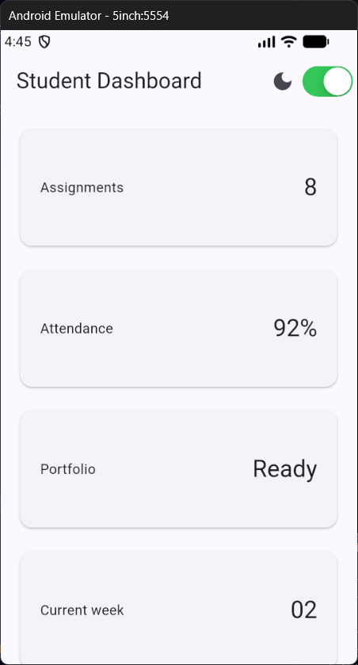
  </figure>
  <figure style="margin: 0; text-align: center;">
    <figcaption><strong>10 Inch</strong></figcaption>
    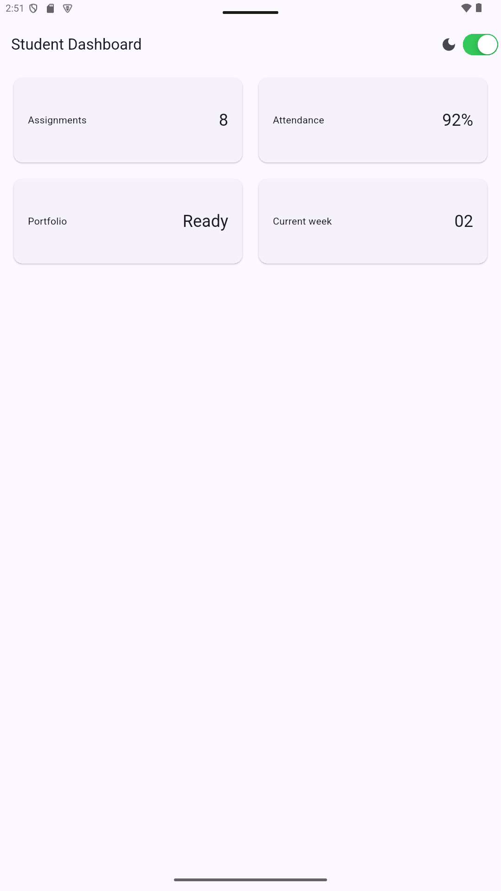
  </figure>
</div>


3. Uji aplikasi dengan ukuran layar emulator yang berbeda.

**5 Inch:**

<table>
  <tr>
    <td></td>
    <td></td>
    <td></td>
    <td></td>
    <td></td>
  </tr>
</table>

**10 Inch:**

<table>
  <tr>
    <td></td>
    <td></td>
    <td></td>
    <td></td>
    <td></td>
  </tr>
</table>

4. Tambahkan Semantics atau label yang bermakna pada elemen yang penting bagi screen reader.

**Jawaban:**

Pada `lib/main.dart`, elemen penting dibungkus dengan widget `Semantics` agar dapat dibacakan oleh *_screen reader_* (mis. TalkBack/VoiceOver):

- **Kartu dashboard** (`DashboardCard`) dibungkus `Semantics(label: '$title: $value')` sehingga setiap kartu diumumkan sebagai contoh "Assignments: 8" bukan hanya teks terpisah.
- **Toggle mode gelap** (`CupertinoSwitch`) dibungkus `Semantics(label: 'Aktifkan mode gelap', toggled: isDark)` agar *screen reader* mengenali fungsi dan status nyala/matinya.

```dart
// DashboardCard
return Semantics(
  label: '$title: $value',
  child: Card(
    child: Padding(
      padding: const EdgeInsets.all(20),
      child: Row(children: [
        Expanded(child: Text(title)),
        Text(value, style: Theme.of(context).textTheme.headlineSmall),
      ]),
    ),
  ),
);

// Toggle dark mode di AppBar
Semantics(
  label: 'Aktifkan mode gelap',
  toggled: isDark,
  child: Row(
    children: [
      Icon(isDark ? Icons.dark_mode : Icons.light_mode),
      const SizedBox(width: 4),
      CupertinoSwitch(value: isDark, onChanged: onDarkChanged),
    ],
  ),
)
```

Dengan penambahan ini, pengguna disabilitas netra dapat memahami nama dan nilai setiap kartu serta dapat mengoperasikan pengalih tema secara bermakna.

# 3. Tugas dan AI design exploration

## Tugas utama

Kembangkan dashboard menjadi halaman **Academic Overview** dengan ketentuan:

- Memiliki header profil dan minimal empat kartu informasi.
- Menggunakan `Row`, `Column`, `Expanded`, dan `Container`.
- Menampilkan satu kolom pada layar sempit dan dua kolom pada layar lebar.
- Menyediakan light theme dan dark theme yang tetap terbaca, dengan toggle tema (misal `CupertinoSwitch` atau `Switch.adaptive`).
- Memiliki label aksesibilitas untuk informasi atau tombol penting.
- Menyertakan screenshot layar sempit dan lebar pada folder `screenshots/`

### Kode Lengkap

```dart
import 'package:flutter/material.dart';
import 'package:flutter/cupertino.dart';
void main() => runApp(const AcademicOverviewApp());

class AcademicOverviewApp extends StatefulWidget {
  const AcademicOverviewApp({super.key});

  @override
  State<AcademicOverviewApp> createState() => _AcademicOverviewAppState();
}

class _AcademicOverviewAppState extends State<AcademicOverviewApp> {
  bool isDark = false;

  @override
  Widget build(BuildContext context) {
    return MaterialApp(
      // showSemanticsDebugger: true,
      debugShowCheckedModeBanner: false,
      theme: ThemeData(
        useMaterial3: true,
        colorSchemeSeed: Colors.indigo,
        brightness: Brightness.light,
      ),
      darkTheme: ThemeData(
        useMaterial3: true,
        colorSchemeSeed: Colors.indigo,
        brightness: Brightness.dark,
      ),
      themeMode: isDark ? ThemeMode.dark : ThemeMode.light,
      home: AcademicOverviewPage(
        isDark: isDark,
        onDarkChanged: (value) => setState(() => isDark = value),
      ),
    );
  }
}

class AcademicOverviewPage extends StatelessWidget {
  const AcademicOverviewPage({
    required this.isDark,
    required this.onDarkChanged,
    super.key,
  });
  final bool isDark;
  final ValueChanged<bool> onDarkChanged;

  static const List<_Info> _infos = [
    _Info('Assignments', '8'),
    _Info('Attendance', '92%'),
    _Info('Portfolio', 'Ready'),
    _Info('Current week', '02'),
  ];

  @override
  Widget build(BuildContext context) {
    return Scaffold(
      appBar: AppBar(
        title: const Text('Academic Overview'),
        actions: [
          Semantics(
            label: 'Aktifkan mode gelap',
            toggled: isDark,
            child: Row(
              children: [
                Icon(isDark ? Icons.dark_mode : Icons.light_mode),
                const SizedBox(width: 4),
                CupertinoSwitch(value: isDark, onChanged: onDarkChanged),
                const SizedBox(width: 12),
              ],
            ),
          ),
        ],
      ),
      body: LayoutBuilder(
        builder: (context, constraints) {
          final columns = constraints.maxWidth >= 700 ? 2 : 1;
          return SingleChildScrollView(
            padding: const EdgeInsets.all(16),
            child: Column(
              crossAxisAlignment: CrossAxisAlignment.start,
              children: [
                const _ProfileHeader(),
                const SizedBox(height: 16),
                _buildInfoGrid(columns),
              ],
            ),
          );
        },
      ),
    );
  }

  Widget _buildInfoGrid(int columns) {
    final cards = _infos
        .map((info) => InfoCard(title: info.title, value: info.value))
        .toList();
    final rows = <Widget>[];
    for (var i = 0; i < cards.length; i += columns) {
      final end = (i + columns < cards.length) ? i + columns : cards.length;
      final chunk = cards.sublist(i, end);
      rows.add(
        Row(
          crossAxisAlignment: CrossAxisAlignment.start,
          children: chunk.map((c) => Expanded(child: c)).toList(),
        ),
      );
      rows.add(const SizedBox(height: 16));
    }
    return Column(children: rows);
  }
}

class _Info {
  const _Info(this.title, this.value);
  final String title;
  final String value;
}

class _ProfileHeader extends StatelessWidget {
  const _ProfileHeader();

  @override
  Widget build(BuildContext context) {
    final theme = Theme.of(context);
    return Semantics(
      label:
          'Profil mahasiswa Robby Catur Wicaksono, NIM 244107020048, Kelas TI-3H',
      child: Container(
        padding: const EdgeInsets.all(16),
        decoration: BoxDecoration(
          color: theme.colorScheme.primaryContainer,
          borderRadius: BorderRadius.circular(16),
        ),
        child: Row(
          children: [
            const CircleAvatar(radius: 30, child: Icon(Icons.person, size: 30)),
            const SizedBox(width: 16),
            Expanded(
              child: Column(
                crossAxisAlignment: CrossAxisAlignment.start,
                children: [
                  Text('Robby Catur Wicaksono',
                      style: theme.textTheme.titleLarge),
                  Text('NIM: 244107020048'),
                  Text('Kelas: TI-3H'),
                  Text('Email: robbycatur330@gmail.com'),
                ],
              ),
            ),
          ],
        ),
      ),
    );
  }
}

class InfoCard extends StatelessWidget {
  const InfoCard({required this.title, required this.value, super.key});
  final String title;
  final String value;

  @override
  Widget build(BuildContext context) {
    final theme = Theme.of(context);
    return Semantics(
      label: '$title: $value',
      child: Container(
        padding: const EdgeInsets.all(20),
        decoration: BoxDecoration(
          color: theme.cardColor,
          borderRadius: BorderRadius.circular(16),
          border: Border.all(color: theme.dividerColor),
        ),
        child: Column(
          crossAxisAlignment: CrossAxisAlignment.start,
          children: [
            Text(title, style: theme.textTheme.titleMedium),
            const SizedBox(height: 8),
            Text(value, style: theme.textTheme.headlineSmall),
          ],
        ),
      ),
    );
  }
}
```

### Hasil Running

**5 Inch:**

<table>
  <tr>
    <td>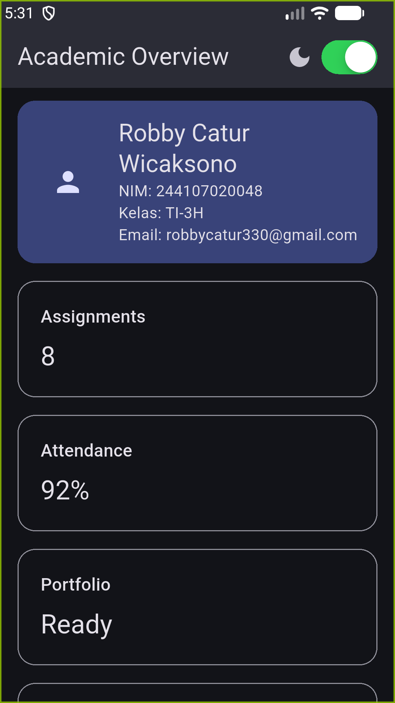</td>
    <td>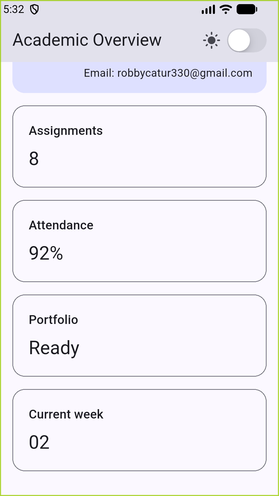</td>
    <td>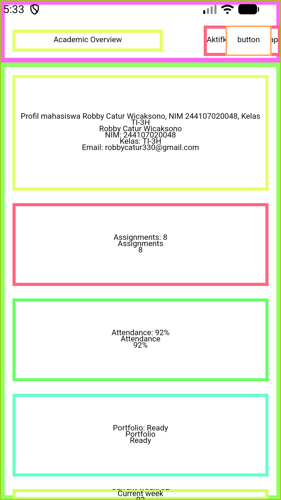</td>
    <td>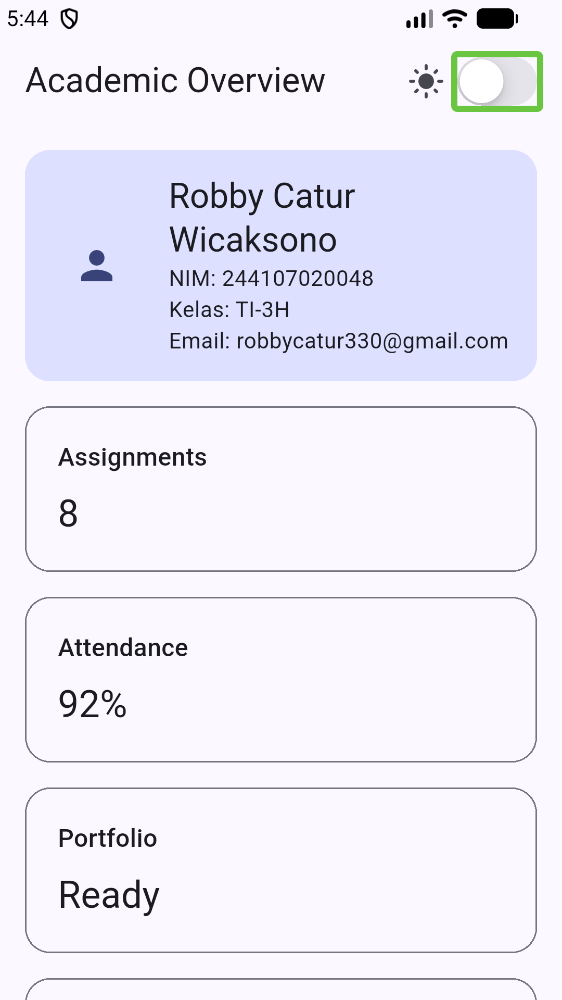</td>
  </tr>
</table>

**10 Inch:**

<table>
  <tr>
    <td>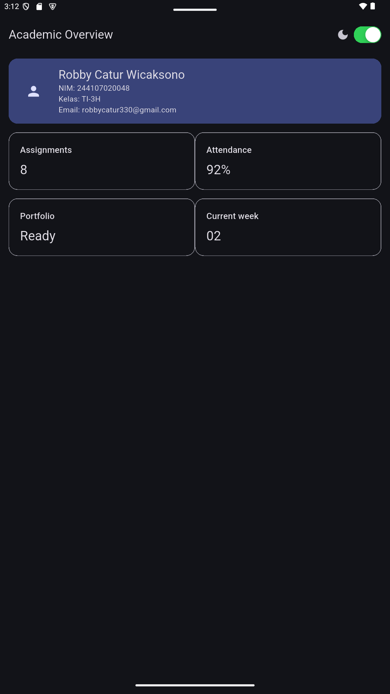</td>
    <td>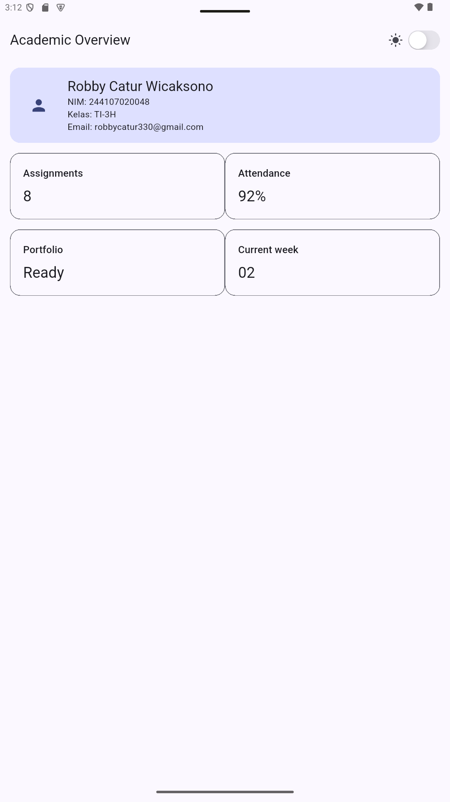</td>
    <td>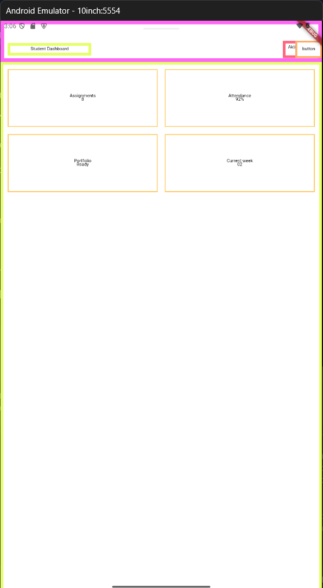</td>
    <td>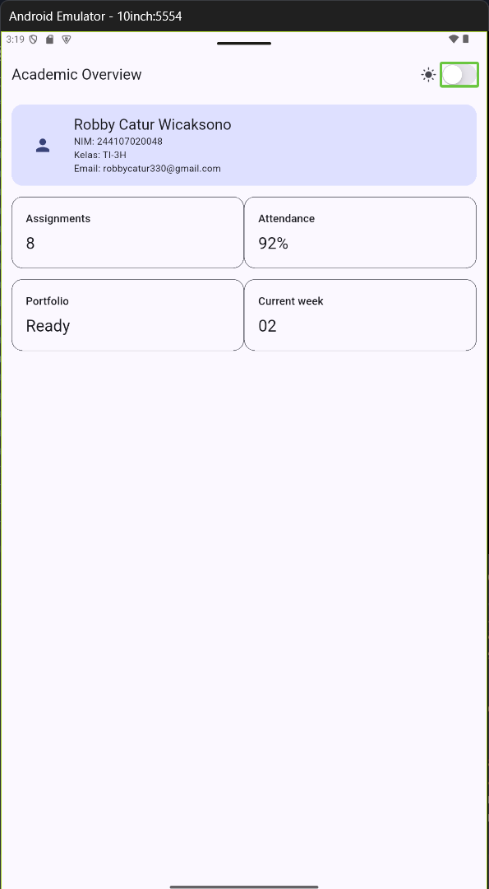</td>
  </tr>
</table>

## AI Prompt Challenge

Setelah implementasi mandiri selesai, gunakan AI hanya untuk membandingkan dua alternatif tata letak. Kerjakan challenge berikut:

1. **Prompt desain**. Ajukan prompt ini (atau variasinya): "Bandingkan dua tata letak dashboard akademik untuk Flutter: versi `GridView` dan versi `LayoutBuilder` + `Column`. Jelaskan trade-off responsif dan aksesibilitasnya."

**Prompt:**
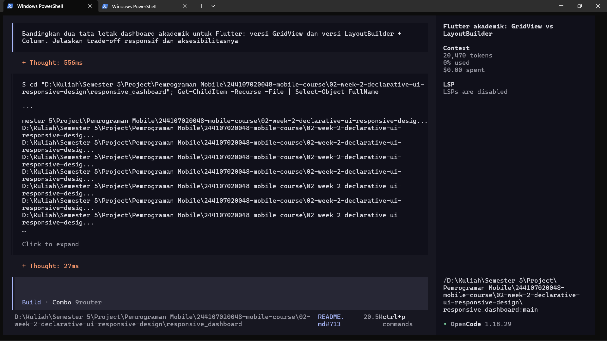

**Jawaban AI:**

Dua alternatif dibandingkan dari kode Praktikum 2 (`GridView`) dan Tugas (`LayoutBuilder` + `Column`).

### Responsif

| Aspek | `GridView` (`GridView.count`) | `LayoutBuilder` + `Column` |
|-------|------------------------------|----------------------------|
| Trigger breakpoint | Sama: `constraints.maxWidth >= 700 ? 2 : 1` | Sama |
| Pengaturan kolom | Otomatis, cukup set `crossAxisCount` | Manual: loop mengelompokkan kartu menjadi `Row` (README:595-605) |
| Skalabilitas konten | `childAspectRatio: 2.6` **mengunci tinggi kartu** | Kartu tumbuh mengikuti isinya (`Column` di dalam `Container`) |
| Elemen non-grid | Kaku, sel sama ukuran | Mudah: header profil + grid dalam satu `SingleChildScrollView` |
| List panjang | `GridView.builder` lazy-render → efisien | `SingleChildScrollView` membangun semua → berat bila item banyak |

**Trade-off:** `GridView` lebih ringan & deklaratif untuk data banyak, tapi kaku dan berisiko ter-clip bila isi membesar. `LayoutBuilder` + `Column` memberi kendali penuh & fleksibel untuk layout campuran, namun logika chunk manual (rawan bug saat mengubah jumlah kolom) dan kurang efisien untuk list besar.

### Aksesibilitas

| Aspek | `GridView` | `LayoutBuilder` + `Column` |
|-------|------------|----------------------------|
| Screen reader | `Semantics(label: '$title: $value')` → "Assignments: 8" | Sama (README:662-663) |
| Font besar / Dynamic Text | **Rentan**: tinggi dikunci `childAspectRatio` → teks kepotong | **Aman**: kartu melebar/tinggi mengikuti teks |
| Urutan fokus | Row-major otomatis | Row-major dari chunk manual (sama) |
| Kekurangan bersama | Tidak mengecek `textScaleFactor` | Tidak mengecek `textScaleFactor` |

**Trade-off:** Keduanya sudah memberi label `Semantics` yang baik. Keunggulan aksesibilitas `Column` ada pada kartu *content-driven* — aman untuk pengguna yang menaikkan ukuran font. Kelemahan bersama: breakpoint hanya melihat `maxWidth`, tidak adaptif terhadap *text scale* (kartu tetap 2 kolom padahal font diperbesar hingga overflow).

### Keputusan & alasan teknis
Untuk dashboard akademik ini (header + 4 kartu, butuh fleksibel & aman terhadap font besar) dipilih **`LayoutBuilder` + `Column`** (sesuai implementasi Tugas). Bila suatu saat kartu metrik bertambah banyak dan seragam, beralih ke `GridView` (idealnya `SliverGridDelegateWithMaxCrossAxisExtent` agar kolom *fluid* tanpa breakpoint kaku) lebih tepat untuk efisiensi render.

### Bukti verifikasi
- Screenshot layar sempit (5 Inch) & lebar (10 Inch): `screenshots/tugas1_01_5inch.png` … `tugas1_04_10inch.png` (README:689-707).
- `Semantics` pada kartu & toggle memastikan aksesibilitas screen reader tidak menurun.

2. **Prompt penguatan konsep**. "Jelaskan kapan penggunaan `Expanded` justru menyebabkan overflow di dalam `Row`, beri contoh kode yang gagal dan perbaikannya."

**Prompt:**

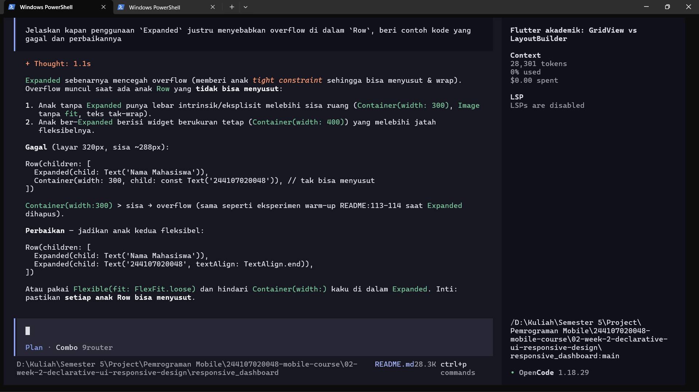

**Jawaban AI:**

`Expanded` sebenarnya **mencegah** overflow karena memberi anak *tight constraint* (lebar maksimal = jatah fleksibel) sehingga anak bisa menyusut & mem-wrap. Overflow di `Row` justru muncul saat ada anak yang **tidak bisa menyusut**, baik karena tidak dibungkus `Expanded` maupun karena widget di dalamnya punya lebar minimal tetap.

**Kapan overflow terjadi:**
1. Anak tanpa `Expanded` memakai lebar intrinsik/eksplisit lebih besar dari sisa ruang (mis. `Container(width: 300)`, `Image` tanpa `fit`, teks sangat panjang yang tidak wrap).
2. Anak ber-`Expanded` berisi widget berukuran tetap (mis. `Container(width: 400)`) yang melebihi jatah fleksibelnya — `Expanded` tidak bisa memaksa widget itu mengecil.

**Kode yang gagal** (layar 320px, padding 16 tiap sisi → sisa ~288px):
```dart
Row(
  children: [
    Expanded(child: Text('Nama Mahasiswa')),
    Container(width: 300, child: const Text('244107020048')), // tidak bisa menyusut
  ],
)
```
`Container(width: 300)` memaksa 300px, melebihi sisa ~288px → **overflow** (lihat juga eksperimen warm-up README:113-114 saat `Expanded` dihapus).

**Perbaikan** — buat anak kedua juga fleksibel / bisa menyusut:
```dart
Row(
  children: [
    Expanded(child: Text('Nama Mahasiswa')),
    Expanded(child: Text('244107020048', textAlign: TextAlign.end)),
  ],
)
```
Atau jika lebar tetap diperlukan, ganti `Expanded` menjadi `Flexible(fit: FlexFit.loose)` pada sisi yang boleh mengecil, dan hindari `Container(width:)` kaku di dalam `Expanded`. Intinya: pastikan **setiap anak `Row` bisa menyusut** (pakai `Expanded`/`Flexible` atau widget yang mem-wrap).


3. **Verification prompt**. Minta AI mengaudit hasilnya sendiri: "Periksa kembali rekomendasi layout di atas: apakah tetap responsif di bawah 600px, apakah mengurangi aksesibilitas, dan apakah ada widget yang tidak tersedia di Flutter stabil saat ini?"

**Prompt:**

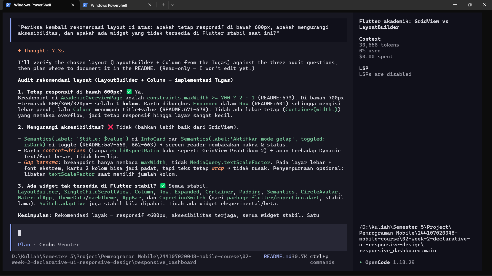

**Jawaban AI (Verifikasi):**

Audit terhadap rekomendasi tata letak terpilih — **`LayoutBuilder` + `Column`** (implementasi Tugas, bukan `GridView` Praktikum 2):

**1. Tetap responsif di bawah 600px?** ✅ Ya.
Breakpoint di `AcademicOverviewPage` adalah `constraints.maxWidth >= 700 ? 2 : 1` (README:573). Di bawah 700px —termasuk 600/360/320px— selalu **1 kolom**. Kartu dibungkus `Expanded` dalam `Row` (README:601) sehingga mengisi lebar penuh, lalu `Column` menumpuk title+value (README:671-678). Tidak ada lebar tetap (`Container(width:)`) yang memaksa overflow, jadi tetap responsif hingga layar sangat kecil.

**2. Mengurangi aksesibilitas?** ❌ Tidak (bahkan lebih baik dari `GridView`).
- `Semantics(label: '$title: $value')` di `InfoCard` dan `Semantics(label: 'Aktifkan mode gelap', toggled: isDark)` di toggle (README:557-568, 662-663) → *screen reader* (TalkBack/VoiceOver) membacakan makna & status.
- Kartu *content-driven* (tanpa `childAspectRatio` kaku seperti `GridView` Praktikum 2) → aman terhadap Dynamic Text/font besar, tidak ke-clip.
- *Gap bersama*: breakpoint hanya membaca `maxWidth`, tidak `MediaQuery.textScaleFactor`. Pada layar lebar + font ekstrem, kartu 2 kolom bisa jadi padat, tapi teks tetap *wrap* → tidak rusak. Penyempurnaan opsional: libatkan `textScaleFactor` saat memilih jumlah kolom.

**3. Ada widget tak tersedia di Flutter stabil?** ✅ Semua stabil.
`LayoutBuilder`, `SingleChildScrollView`, `Column`, `Row`, `Expanded`, `Container`, `Padding`, `Semantics`, `CircleAvatar`, `MaterialApp`, `ThemeData`/`darkTheme`, `AppBar`, dan `CupertinoSwitch` (dari `package:flutter/cupertino.dart`, stabil lama). `Switch.adaptive` juga stabil bila dipakai. Tidak ada widget eksperimental/beta.

**Kesimpulan:** Rekomendasi layak — responsif di bawah 600px, aksesibilitas terjaga (bahkan lebih baik dari `GridView` untuk font besar), dan semua widget tersedia di Flutter stabil. Satu penyempurnaan opsional: adaptasi breakpoint terhadap `textScaleFactor`.

4. **Dokumentasikan**. Simpan prompt, output penting, keputusan yang dipilih, alasan teknis, dan bukti verifikasi (test/screenshots) di README tugas minggu ini.

**Jawaban Saya:**
Prompt, output, keputusan, alasan, dan bukti verifikasi sudah saya simpan di folder `screenshots`

5. **Kriteria lolos**: saran AI yang Anda pakai benar-benar berjalan, responsif, tidak menurunkan aksesibilitas, dan Anda mampu menjelaskan setiap keputusannya saat code review, bukan sekadar menyalin output AI.

**Prompt dan Saran AI:**
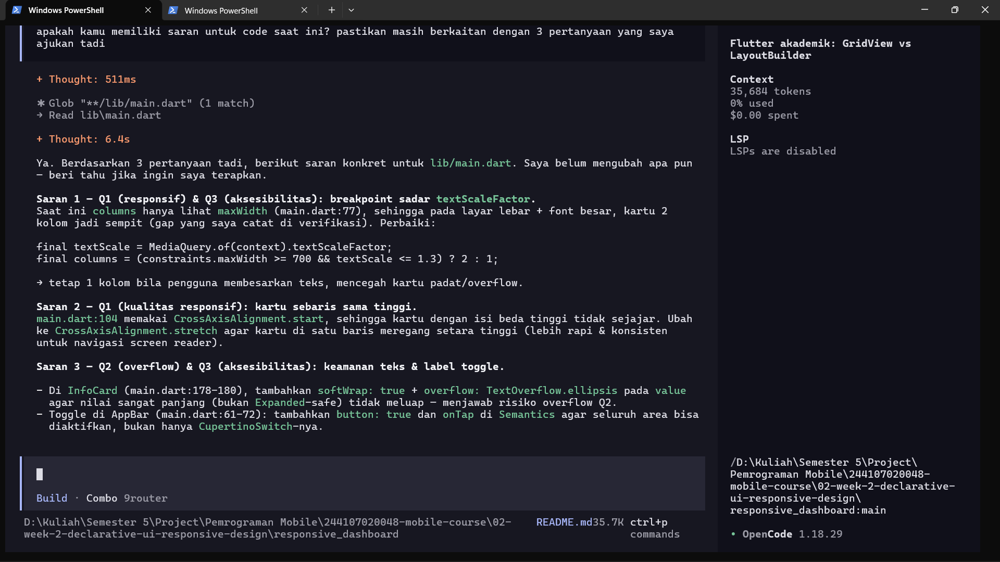

**Perubahan Berdasarkan Saran AI:**

```dart
// removed
final columns = constraints.maxWidth >= 700 ? 2 : 1;

// changes
final textScale = MediaQuery.of(context).textScaler.scale(16) / 16;
final columns = (constraints.maxWidth >= 700 && textScale <= 1.3) ? 2 : 1;

// removed
crossAxisAlignment: CrossAxisAlignment.start,

// changes
crossAxisAlignment: CrossAxisAlignment.stretch,

// removed
Text(value, style: theme.textTheme.headlineSmall)

// changes
Text(
  value,
  style: theme.textTheme.headlineSmall,
  softWrap: true,
  overflow: TextOverflow.ellipsis,
),

// some line added
actions: [
  Semantics(
    label: 'Aktifkan mode gelap',
    toggled: isDark,
    // Added Line --- Start
    button: true,
    onTap: () => onDarkChanged(!isDark),
    // Added Line --- End
    child: Row(
```

**Jawaban Saya:**
Karena perubahan nama class (sebelumnya `MyApp`) menjadi `AcademicOverviewApp`, hasil run `flutter analyze` menghasilkan error seperti berikut

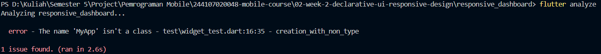

Setelah diperbaiki maka tidak ada masalah


Kesimpulan: Saran AI masuk dalam kriteria **Lolos** karena memenuhi kriteria: berjalan, responsif, dan tidak menurunkan aksesibilitas.

### Refactoring challenge

Setelah tugas utama berjalan, rapikan kode Anda:

1. Ekstrak kartu informasi menjadi widget reusable (misal InfoCard) yang menerima title dan value, sehingga tidak ada duplikasi widget.
2. Ganti warna dan ukuran yang di-hardcode dengan Theme.of(context) agar mengikuti tema terang/gelap secara otomatis.
3. Pindahkan breakpoint ke satu konstanta bernama (misal const kWideBreakpoint = 700;) agar hanya didefinisikan satu kali.
4. Jalankan flutter analyze dan pastikan tidak ada error maupun warning baru.

**Kode yang telah diperbarui:**

```dart
import 'package:flutter/material.dart';
import 'package:flutter/cupertino.dart';

const double kWideBreakpoint = 700;
const double kCardRadius = 16;
const double kCardPadding = 20;
const double kSectionGap = 16;
const double kHeaderPadding = 16;
const double kHeaderAvatarRadius = 30;
const double kCardInnerGap = 8;

void main() => runApp(const AcademicOverviewApp());

class AcademicOverviewApp extends StatefulWidget {
  const AcademicOverviewApp({super.key});

  @override
  State<AcademicOverviewApp> createState() => _AcademicOverviewAppState();
}

class _AcademicOverviewAppState extends State<AcademicOverviewApp> {
  bool isDark = false;

  @override
  Widget build(BuildContext context) {
    return MaterialApp(
      // showSemanticsDebugger: true,
      debugShowCheckedModeBanner: false,
      theme: ThemeData(
        useMaterial3: true,
        colorSchemeSeed: Colors.indigo,
        brightness: Brightness.light,
      ),
      darkTheme: ThemeData(
        useMaterial3: true,
        colorSchemeSeed: Colors.indigo,
        brightness: Brightness.dark,
      ),
      themeMode: isDark ? ThemeMode.dark : ThemeMode.light,
      home: AcademicOverviewPage(
        isDark: isDark,
        onDarkChanged: (value) => setState(() => isDark = value),
      ),
    );
  }
}

class AcademicOverviewPage extends StatelessWidget {
  const AcademicOverviewPage({
    required this.isDark,
    required this.onDarkChanged,
    super.key,
  });
  final bool isDark;
  final ValueChanged<bool> onDarkChanged;

  static const List<_Info> _infos = [
    _Info('Assignments', '8'),
    _Info('Attendance', '92%'),
    _Info('Portfolio', 'Ready'),
    _Info('Current week', '02'),
  ];

  @override
  Widget build(BuildContext context) {
    return Scaffold(
      appBar: AppBar(
        title: const Text('Academic Overview'),
        actions: [
          Semantics(
            label: 'Aktifkan mode gelap',
            toggled: isDark,
            button: true,
            onTap: () => onDarkChanged(!isDark),
            child: Row(
              children: [
                Icon(isDark ? Icons.dark_mode : Icons.light_mode),
                const SizedBox(width: 4),
                CupertinoSwitch(value: isDark, onChanged: onDarkChanged),
                const SizedBox(width: 12),
              ],
            ),
          ),
        ],
      ),
      body: LayoutBuilder(
        builder: (context, constraints) {
          final textScale = MediaQuery.of(context).textScaler.scale(16) / 16;
          final columns = (constraints.maxWidth >= kWideBreakpoint &&
                  textScale <= 1.3)
              ? 2
              : 1;
          return SingleChildScrollView(
            padding: const EdgeInsets.all(kSectionGap),
            child: Column(
              crossAxisAlignment: CrossAxisAlignment.start,
              children: [
                const _ProfileHeader(),
                const SizedBox(height: kSectionGap),
                _buildInfoGrid(columns),
              ],
            ),
          );
        },
      ),
    );
  }

  Widget _buildInfoGrid(int columns) {
    final cards = _infos
        .map((info) => InfoCard(title: info.title, value: info.value))
        .toList();
    final rows = <Widget>[];
    for (var i = 0; i < cards.length; i += columns) {
      final end = (i + columns < cards.length) ? i + columns : cards.length;
      final chunk = cards.sublist(i, end);
      rows.add(
        IntrinsicHeight(
          child: Row(
            crossAxisAlignment: CrossAxisAlignment.stretch,
            children: chunk.map((c) => Expanded(child: c)).toList(),
          ),
        ),
      );
      rows.add(const SizedBox(height: kSectionGap));
    }
    return Column(children: rows);
  }
}

class _Info {
  const _Info(this.title, this.value);
  final String title;
  final String value;
}

class _ProfileHeader extends StatelessWidget {
  const _ProfileHeader();

  @override
  Widget build(BuildContext context) {
    final theme = Theme.of(context);
    return Semantics(
      label:
          'Profil mahasiswa Robby Catur Wicaksono, NIM 244107020048, Kelas TI-3H',
      child: Container(
        padding: const EdgeInsets.all(kHeaderPadding),
        decoration: BoxDecoration(
          color: theme.colorScheme.primaryContainer,
          borderRadius: BorderRadius.circular(kCardRadius),
        ),
        child: Row(
          children: [
            CircleAvatar(
              radius: kHeaderAvatarRadius,
              child: Icon(Icons.person, size: kHeaderAvatarRadius),
            ),
            const SizedBox(width: kSectionGap),
            Expanded(
              child: Column(
                crossAxisAlignment: CrossAxisAlignment.start,
                children: [
                  Text('Robby Catur Wicaksono',
                      style: theme.textTheme.titleLarge),
                  Text('NIM: 244107020048'),
                  Text('Kelas: TI-3H'),
                  Text('Email: robbycatur330@gmail.com'),
                ],
              ),
            ),
          ],
        ),
      ),
    );
  }
}

class InfoCard extends StatelessWidget {
  const InfoCard({required this.title, required this.value, super.key});
  final String title;
  final String value;

  @override
  Widget build(BuildContext context) {
    final theme = Theme.of(context);
    return Semantics(
      label: '$title: $value',
      child: Container(
        padding: const EdgeInsets.all(kCardPadding),
        decoration: BoxDecoration(
          color: theme.cardColor,
          borderRadius: BorderRadius.circular(kCardRadius),
          border: Border.all(color: theme.dividerColor),
        ),
        child: Column(
          crossAxisAlignment: CrossAxisAlignment.start,
          children: [
            Text(title, style: theme.textTheme.titleMedium),
            const SizedBox(height: kCardInnerGap),
            Text(
              value,
              style: theme.textTheme.headlineSmall,
              softWrap: true,
              overflow: TextOverflow.ellipsis,
            ),
          ],
        ),
      ),
    );
  }
}
```

**Hasil `flutter analyze`:**

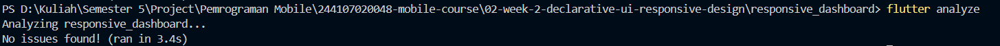

### Checklist verifikasi

1. `flutter analyze` tidak menghasilkan error. ✅
2. `flutter test` lulus semua widget test responsif.✅

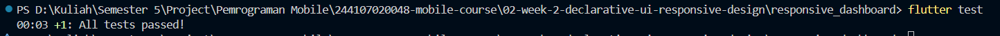

3. Aplikasi dapat dijalankan pada ukuran layar sempit dan lebar. ✅ 
4. Dark mode memiliki kontras dan teks yang terbaca. ✅
5. Struktur widget dapat dijelaskan saat code review. ✅
6. Screenshot, folder test/, dan README sudah tersimpan pada folder tugas Week 2. ✅