| Key | Value |
|------|-----------------------|
| Nama | Robby Catur Wicaksono |
| NIM | 244107060014 |
| Kelas | TI - 3H |
| Mata Kuliah | Pemrograman Mobile |

# 1. Praktikum: layout sederhana (warm-up)

Sebelum dashboard responsif, latih dulu widget dasar dengan membuat kartu profil sederhana. Buat project baru atau ganti sementara isi `lib/main.dart`:

Kode Program : 

```dart
import 'package:flutter/material.dart';

void main() => runApp(const ProfileApp());

class ProfileApp extends StatelessWidget {
  const ProfileApp({super.key});

  @override
  Widget build(BuildContext context) {
    return const MaterialApp(
      debugShowCheckedModeBanner: false,
      home: Scaffold(
        body: Center(child: ProfileCard()),
      ),
    );
  }
}

class ProfileCard extends StatelessWidget {
  const ProfileCard({super.key});

  @override
  Widget build(BuildContext context) {
    return Container(
      width: 320,
      padding: const EdgeInsets.all(16),
      decoration: BoxDecoration(
        color: Colors.indigo.shade50,
        borderRadius: BorderRadius.circular(16),
      ),
      child: Column(
        mainAxisSize: MainAxisSize.min,
        children: [
          Row(
            children: [
              const CircleAvatar(child: Icon(Icons.person)),
              const SizedBox(width: 12),
              Expanded(
                child: Column(
                  crossAxisAlignment: CrossAxisAlignment.start,
                  children: const [
                    Text('Nama Mahasiswa',
                        style: TextStyle(fontWeight: FontWeight.bold)),
                    Text('Robby Catur Wicaksono'),
                  ],
                ),
              ),
            ],
          ),
          const SizedBox(height: 12),
          const Row(children: [
            Expanded(child: Text('NIM')),
            Text('244107020048'),
          ]),
          const Row(children: [
            Expanded(child: Text('Kelas')),
            Text('TI-3H'),
          ]),
        ],
      ),
    );
  }
}
```

Hasil: 

<div style="display: flex; gap: 16px;">
  <figure style="margin: 0; text-align: center;">
    <figcaption><strong>5 Inch</strong></figcaption>
    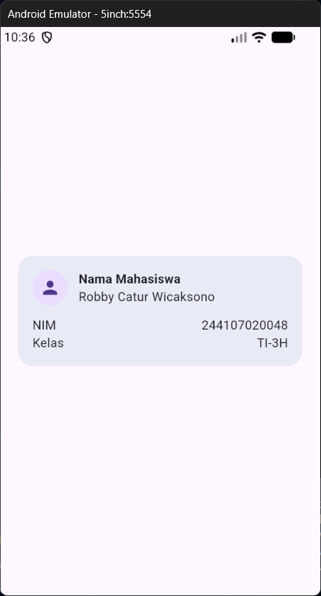
  </figure>
  <figure style="margin: 0; text-align: center;">
    <figcaption><strong>10 Inch</strong></figcaption>
    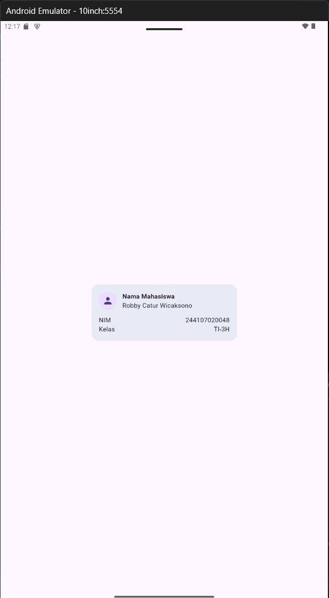
  </figure>
</div>

### Penjelasan

- 5 Inch (ponsel): layar sempit, kartu 320px hampir memenuhi lebar layar, margin kiri-kanan tipis.
- 10 Inch (tablet): layar lebar, kartu tetap 320px sehingga di-center dengan ruang kosong besar di kiri dan kanan
- Perbedaan ini disebabkan oleh kode `width: 320` yang mengunci lebar kartu tetap berukuran 320px tanpa melihat ukuran device pengguna

## Eksperimen warm-up
1. Hapus Expanded pada baris nama, lalu amati peringatan overflow atau perilaku layout-nya; kembalikan setelah itu.

<div style="display: flex; gap: 16px;">
  <figure style="margin: 0; text-align: center;">
    <figcaption><strong>5 Inch</strong></figcaption>
    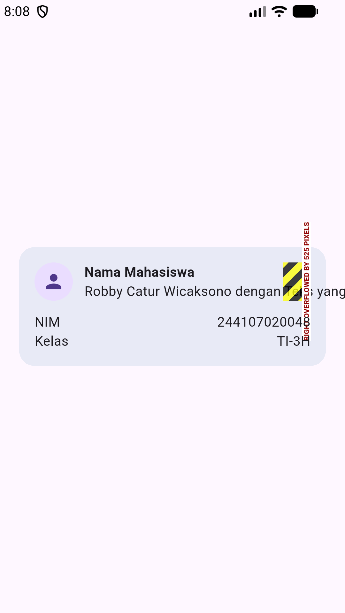
  </figure>
  <figure style="margin: 0; text-align: center;">
    <figcaption><strong>10 Inch</strong></figcaption>
    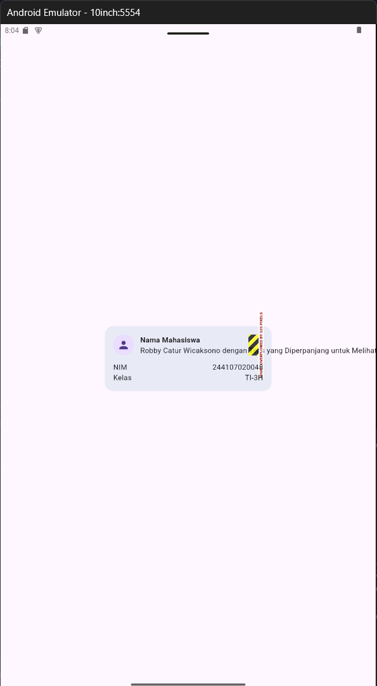
  </figure>
</div>

**Penjelasan:**
Pada gambar, terlihat bahwa teks keluar dari Row yang sudah disiapkan, bahkan melebihi dari ukuran layar. Overflow terjadi karena saat Expanded dihapus, Column nama dibiarkan memakai lebar aslinya sehingga begitu teksnya terlalu panjang melebihi sisa ruang Row, Flutter tidak bisa menyusutkannya dan teks keluar dari batas.

Setelah `Expanded` dikembalikan

<div style="display: flex; gap: 16px;">
  <figure style="margin: 0; text-align: center;">
    <figcaption><strong>5 Inch</strong></figcaption>
    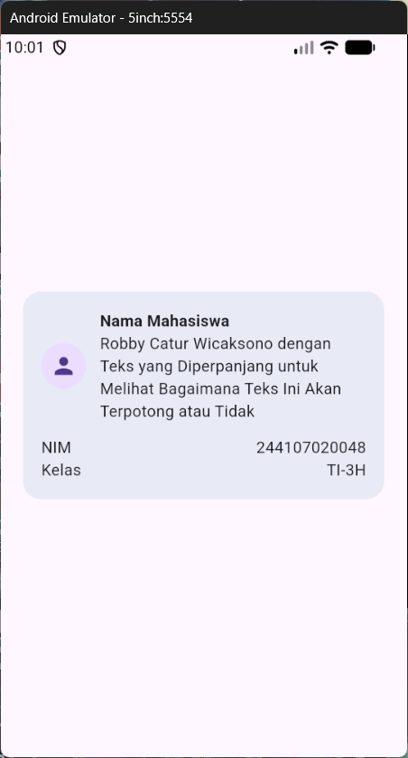
  </figure>
  <figure style="margin: 0; text-align: center;">
    <figcaption><strong>10 Inch</strong></figcaption>
    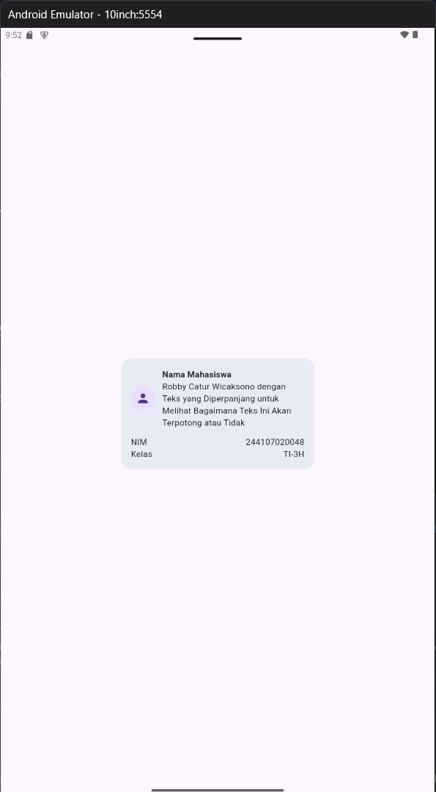
  </figure>
</div>

**Penjelasan:**
Teks sekarang sudah tidak keluar dari row yang sudah disiapkan karena ada `Expanded` sehingga `Flutter` bisa menyusutkan teks tersebut mengikuti ukuran `Row` yang sudah disiapkan

2. Ganti mainAxisSize: MainAxisSize.min menjadi nilai default dan amati perubahan tinggi kartu.

<div style="display: flex; gap: 16px;">
  <figure style="margin: 0; text-align: center;">
    <figcaption><strong>5 Inch</strong></figcaption>
    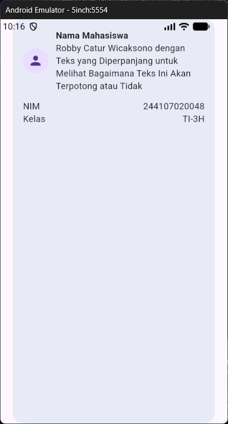
  </figure>
  <figure style="margin: 0; text-align: center;">
    <figcaption><strong>10 Inch</strong></figcaption>
    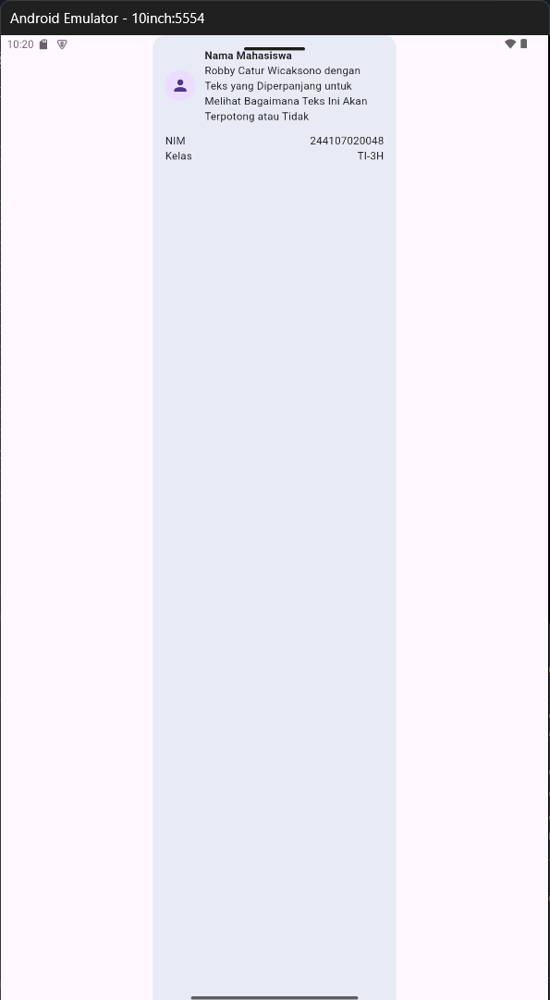
  </figure>
</div>

**Penjelasan:**

- `MainAxisSize.min`: Column hanya setinggi isinya, sehingga kartu profil pendek/ringkas (sesuai tinggi teks + avatar).
- `MainAxisSize.max`: Column mengisi seluruh ruang vertikal pada layar, sehingga kartu memanjang mengikuti tinggi layar dengan konten tetap di bagian atas.

3. Tambahkan satu baris data (misal Email) menggunakan pola Row + Expanded yang sama.

<div style="display: flex; gap: 16px;">
  <figure style="margin: 0; text-align: center;">
    <figcaption><strong>5 Inch</strong></figcaption>
    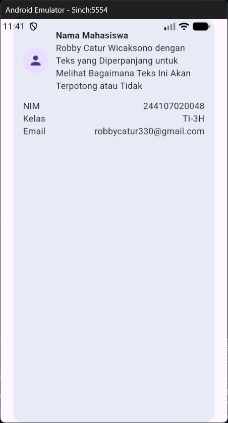
  </figure>
  <figure style="margin: 0; text-align: center;">
    <figcaption><strong>10 Inch</strong></figcaption>
    
  </figure>
</div>

**Penjelasan:**
Membuat satu baris data baru menggunakan pola Row dan Expanded yang sama dengan yang sebelumnya, masih dalam satu baris yang sama dengan NIM dan Kelas.

# 2. Praktikum: dashboard responsif

Buka `lib/main.dart`. Buat aplikasi profil sederhana berikut, lalu jalankan pada emulator atau perangkat fisik.

```dart
import 'package:flutter/material.dart';

void main() => runApp(const DashboardApp());

class DashboardApp extends StatelessWidget {
  const DashboardApp({super.key});

  @override
  Widget build(BuildContext context) {
    return MaterialApp(
      debugShowCheckedModeBanner: false,
      theme: ThemeData(useMaterial3: true, colorSchemeSeed: Colors.indigo),
      darkTheme: ThemeData(useMaterial3: true, brightness: Brightness.dark, colorSchemeSeed: Colors.indigo),
      themeMode: ThemeMode.system,
      home: const DashboardPage(),
    );
  }
}

class DashboardPage extends StatelessWidget {
  const DashboardPage({super.key});

  @override
  Widget build(BuildContext context) {
    return Scaffold(
      appBar: AppBar(title: const Text('Student Dashboard')),
      body: LayoutBuilder(
        builder: (context, constraints) {
          final columns = constraints.maxWidth >= 700 ? 2 : 1;
          return GridView.count(
            padding: const EdgeInsets.all(16),
            crossAxisCount: columns,
            crossAxisSpacing: 16,
            mainAxisSpacing: 16,
            childAspectRatio: 2.6,
            children: const [
              DashboardCard(title: 'Assignments', value: '8'),
              DashboardCard(title: 'Attendance', value: '92%'),
              DashboardCard(title: 'Portfolio', value: 'Ready'),
              DashboardCard(title: 'Current week', value: '02'),
            ],
          );
        },
      ),
    );
  }
}

class DashboardCard extends StatelessWidget {
  const DashboardCard({required this.title, required this.value, super.key});
  final String title;
  final String value;

  @override
  Widget build(BuildContext context) {
    return Card(
      child: Padding(
        padding: const EdgeInsets.all(20),
        child: Row(children: [
          Expanded(child: Text(title)),
          Text(value, style: Theme.of(context).textTheme.headlineSmall),
        ]),
      ),
    );
  }
}
```

Hasil:

<div style="display: flex; gap: 16px;">
  <figure style="margin: 0; text-align: center;">
    <figcaption><strong>5 Inch</strong></figcaption>
    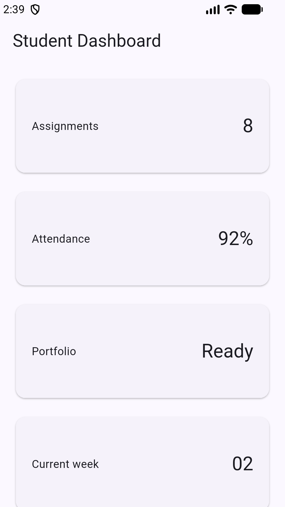
  </figure>
  <figure style="margin: 0; text-align: center;">
    <figcaption><strong>10 Inch</strong></figcaption>
    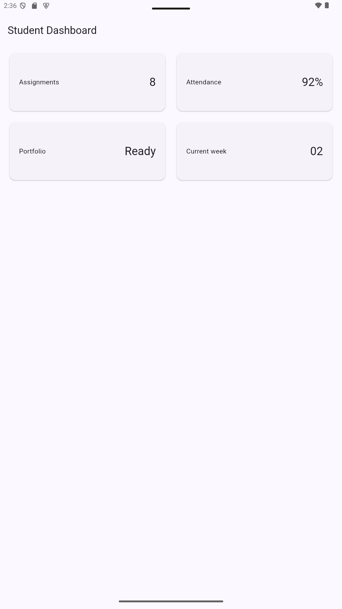
  </figure>
</div>

## Menambahkan interaksi: StatefulWidget dan Cupertino

Sejauh ini dashboard masih `StatelessWidget`. Ubah `DashboardApp` menjadi `StatefulWidget` dan tambahkan `CupertinoSwitch` (widget Cupertino) pada `AppBar` untuk mengganti tema secara manual — sekaligus membedakan komponen Material dan Cupertino secara langsung:

```dart
class DashboardApp extends StatefulWidget {
  const DashboardApp({super.key});

  @override
  State<DashboardApp> createState() => _DashboardAppState();
}

class _DashboardAppState extends State<DashboardApp> {
  bool isDark = false;

  @override
  Widget build(BuildContext context) {
    return MaterialApp(
      debugShowCheckedModeBanner: false,
      theme: ThemeData(useMaterial3: true, colorSchemeSeed: Colors.indigo),
      darkTheme: ThemeData(useMaterial3: true, brightness: Brightness.dark, colorSchemeSeed: Colors.indigo),
      themeMode: isDark ? ThemeMode.dark : ThemeMode.light,
      home: DashboardPage(
        isDark: isDark,
        onDarkChanged: (value) => setState(() => isDark = value),
      ),
    );
  }
}
```

Sesuaikan `DashboardPage` agar menerima state dan callback:

```dart
class DashboardPage extends StatelessWidget {
  const DashboardPage({
    required this.isDark,
    required this.onDarkChanged,
    super.key,
  });
  final bool isDark;
  final ValueChanged<bool> onDarkChanged;

  @override
  Widget build(BuildContext context) {
    return Scaffold(
      appBar: AppBar(
        title: const Text('Student Dashboard'),
        actions: [
          Row(
            children: [
              Icon(isDark ? Icons.dark_mode : Icons.light_mode),
              const SizedBox(width: 4),
              CupertinoSwitch(
                value: isDark,
                onChanged: onDarkChanged,
              ),
              const SizedBox(width: 12),
            ],
          ),
        ],
      ),
      body: LayoutBuilder(
        // ... kode GridView sebelumnya, tidak berubah
      ),
    );
  }
}
```

Hasil:

<div style="display: flex; gap: 16px;">
  <figure style="margin: 0; text-align: center;">
    <figcaption><strong>5 Inch</strong></figcaption>
    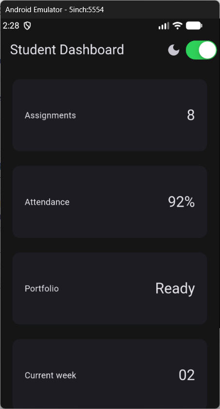
  </figure>
  <figure style="margin: 0; text-align: center;">
    <figcaption><strong>10 Inch</strong></figcaption>
    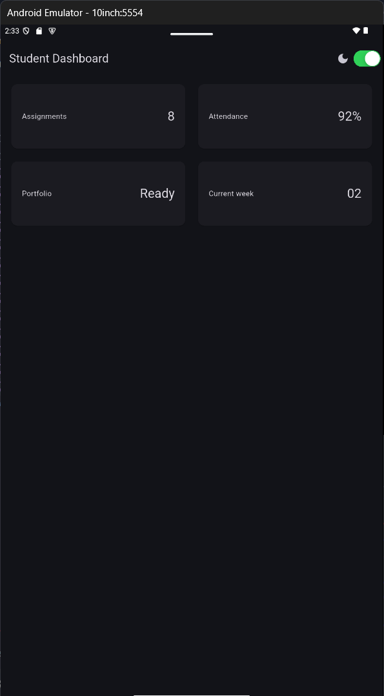
  </figure>
</div>

**Penjelasan:**
Widget yang dihasilkan oleh `Cupertino` memiliki tampilan khas Apple, yang berbeda dengan widget yang dihasilkan oleh `Material` yang memiliki gaya Android/Google. Di method `CupertinoSwitch`, `value` digunakan untuk menentukan posisi _switch_ atau _toggle_ dan `onChanged` meupakan _callback_ yang dipicu saat _toggle_ digeser.

<p style="background-color: #FEF7E0; border-left: solid 5px; border-radius: 10px; border-color: orange; padding: 10px">CupertinoSwitch berasal dari pustaka Cupertino — tambahkan import package:flutter/cupertino.dart; di bagian atas file. Bandingkan dengan Switch.adaptive milik Material yang otomatis menampilkan tampilan Cupertino di iOS.
</p>

**Tabel Hasil Perbandingan**

| Aspek | CupertinoSwitch | Switch.adaptive |
|-------|-----------------|-----------------|
| Asal | Paket flutter/cupertino.dart | Paket flutter/material.dart |
| Tampilan | Selalu gaya iOS di platform apa pun | Otomatis menyesuaikan (Cupertino di iOS, Material di Android/Web/Desktop) |
| Properti | value, onChanged | value, onChanged, plus activeColor, materialTapTargetSize, dll |
| Pemakaian | Saat aplikasi ingin tampilan persis iOS | Saat aplikasi ingin konsisten dengan konvensi tiap OS |