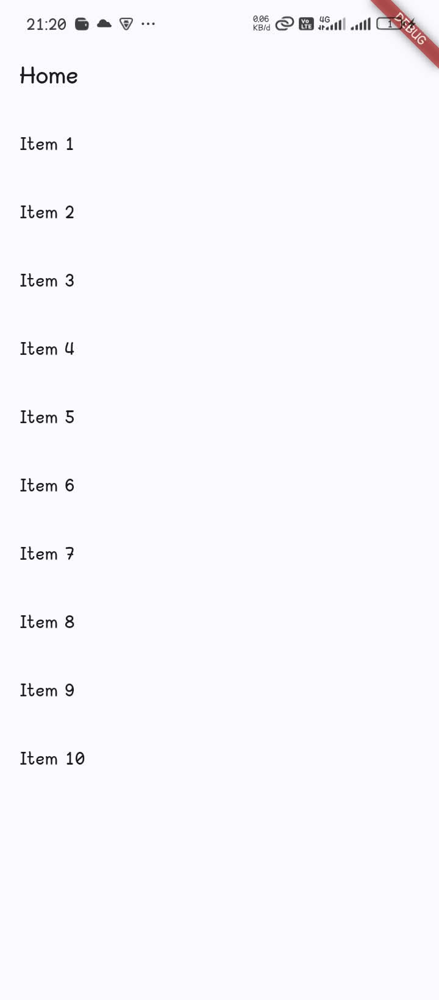
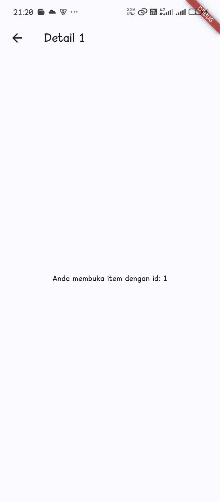
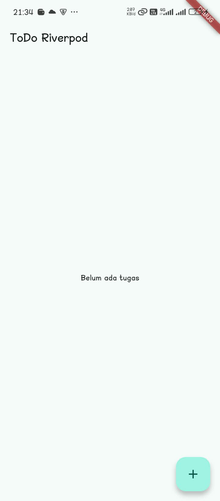
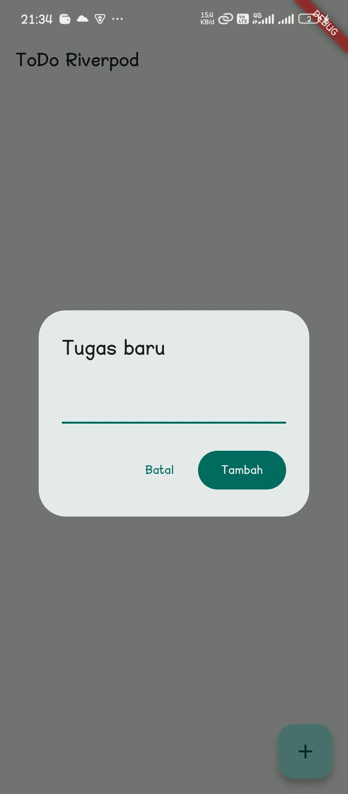
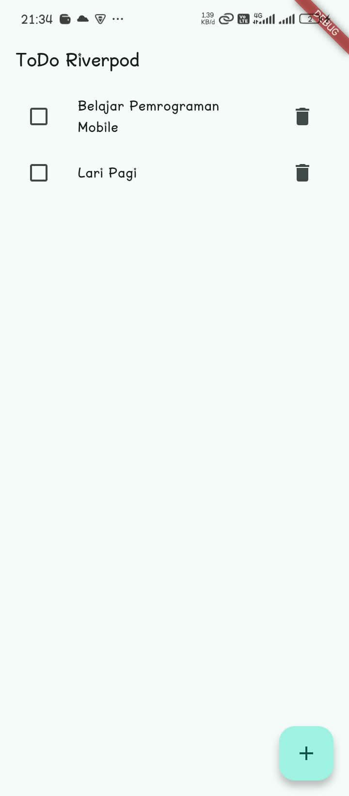
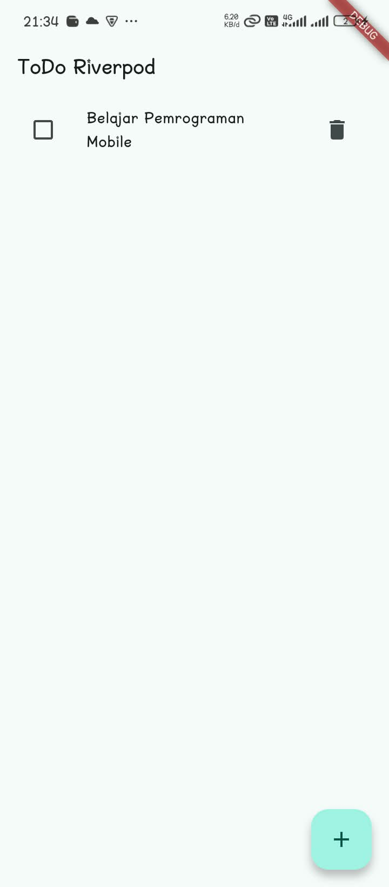
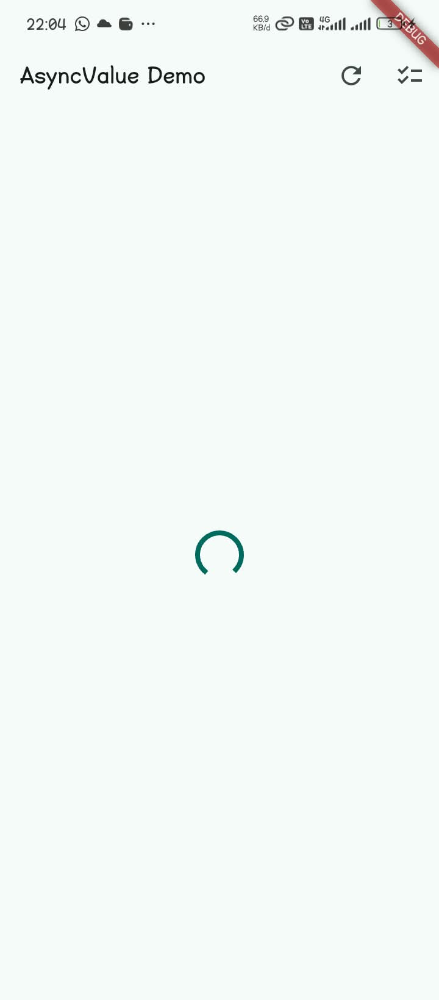
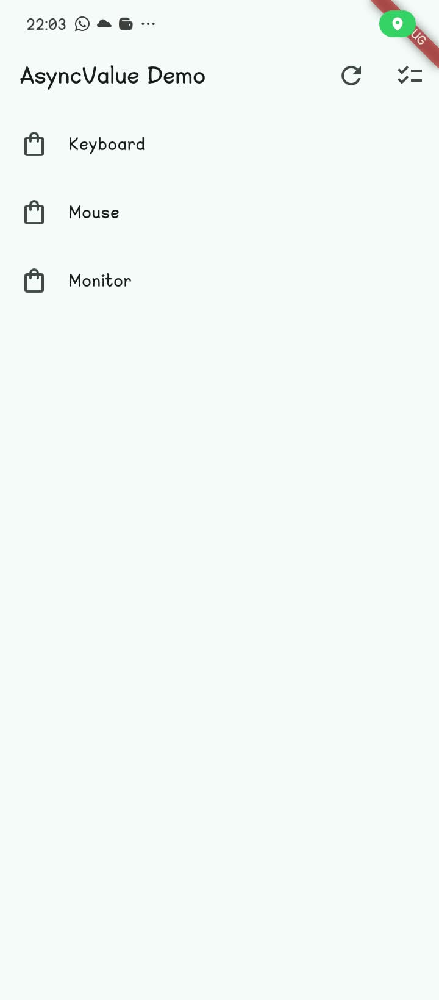
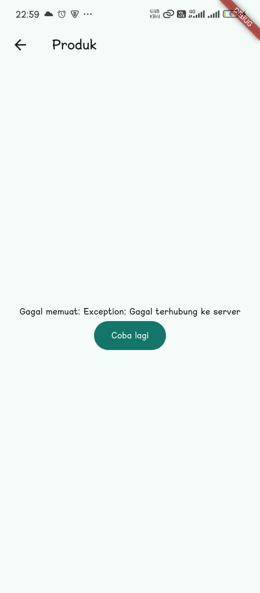
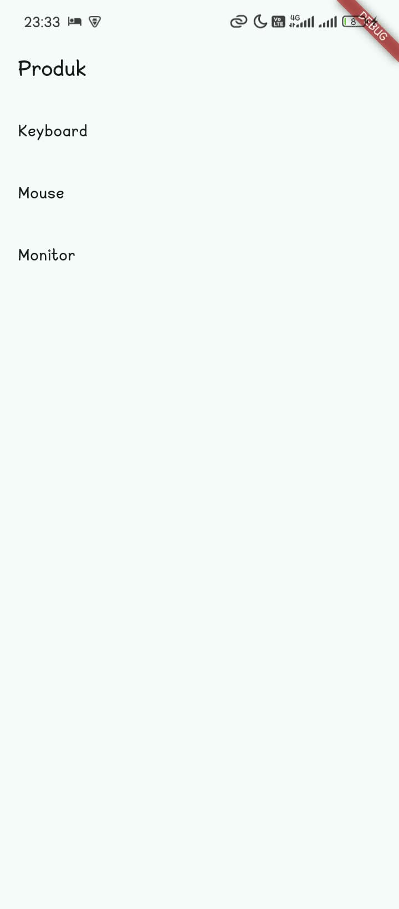

| Key | Value |
|------|-----------------------|
| Nama | Robby Catur Wicaksono |
| NIM | 244107060014 |
| Kelas | TI - 3H |
| Mata Kuliah | Pemrograman Mobile |

# 1. Konsep navigasi dan GoRouter

**Home Page**



**Detail Page**



**Penjelasan**

Proyek `week3_navigation` memakai **go_router**. `main.dart` mendeklarasikan
`GoRouter` dengan `initialLocation: '/'` dan satu `GoRoute` induk (`'/'` ->
`HomePage`) yang punya rute bersarang `'detail/:id'` -> `DetailPage`.
`MaterialApp` diganti `MaterialApp.router(routerConfig: _router)` supaya router
yang mengatur stack halaman. Di `HomePage`, tiap item list memanggil
`context.go('/detail/${index + 1}')`; go_router membaca parameter path lewat
`state.pathParameters['id']` lalu meneruskannya ke `DetailPage(id: ...)`.
Hasilnya: `DetailPage` menampilkan "id" yang sesuai dan tombol back (`AppBar`
leading) otomatis kembali ke Home tanpa navigasi manual.

## 2. State management dengan Riverpod

**Home Page**



**Add To Do**



**Setelah To Do Ditambahkan**



**Setelah Tombol Sampah (Hapus) Diklik**



**Penjelasan**

Proyek ToDo memisahkan state dari widget memakai **Riverpod**.
`TodoListNotifier extends Notifier<List<Todo>>` menyimpan daftar tugas; tiap aksi
(`add`, `toggle`, `remove`) mengganti `state` dengan **list baru** (immutable,
memakai `copyWith`), bukan mutasi langsung, sehingga Riverpod mendeteksi
perubahan. `todoListProvider = NotifierProvider<...>` dibuka sebagai akses
publik. `TodoPage` adalah `ConsumerWidget`: `ref.watch(todoListProvider)` di
dalam `build` (agar UI rebuild saat state berubah), sedangkan aksi memakai
`ref.read(todoListProvider.notifier)` di callback tombol/checkbox.
`ProviderScope` membungkus root di `main.dart` sebagai tempat tinggal state.
Alur pada screenshot: daftar kosong ("Belum ada tugas") -> dialog "Tambah" ->
item muncul (dicoret saat `done`) -> tombol sampah menghapus item; semua
perubahan terjadi tanpa `setState`, cukup dengan memperbarui provider.

## 3. AsyncValue: loading, error, success

1. Salin kode di atas ke project ToDo Anda (atau project terpisah) dan jalankan. Amati tampilan loading selama 2 detik pertama.

**Loading**



**Home Page**



2. Ubah `build()` sementara untuk melempar error: `throw Exception('Gagal terhubung ke server');`. Jalankan dan amati UI error beserta tombol Coba lagi.

```dart
class ProductsNotifier extends AsyncNotifier<List<String>> {
  @override
  Future<List<String>> build() async {
    throw Exception('Gagal terhubung ke server');
  }
  // ...
}
```



3. Tekan tombol Coba lagi, `ref.invalidate` membuat provider dijalankan ulang. Pulihkan kode, pastikan state success tampil.

Kembalikan `build()` ke versi normal (hapus `throw`):

```dart
class ProductsNotifier extends AsyncNotifier<List<String>> {
  @override
  Future<List<String>> build() async {
    await Future.delayed(const Duration(seconds: 2)); // simulasi network
    return ['Keyboard', 'Mouse', 'Monitor'];
  }
  // ...
}
```

`onPressed` tombol "Coba lagi" memanggil `ref.invalidate(productsProvider)`. Ini membuang cache, menjalankan ulang `build()`, sehingga urutan state berjalan lagi: `loading` (spinner 2 detik) → `data` (daftar `Keyboard`, `Mouse`, `Monitor`). Karena `build()` sudah pulih, state success tampil, bukan error.



4. Refleksikan: mengapa menampilkan ulang data lama (stale data) dengan indikator refresh kadang lebih baik daripada mengosongkan layar? Kapan pola itu penting?

```text
Menampilkan data lama dengan indikator refresh lebih baik karena pengguna tetap mendapatkan informasi dan konteks sambil menunggu data terbaru dimuat. Pola ini penting ketika data lama masih relevan dan proses pengambilan data baru membutuhkan waktu atau bergantung pada koneksi jaringan.
```

## 4. AI Challenge

**Prompt:**

```text
Buatkan halaman Flutter bernama StatsPage menggunakan flutter_riverpod.
Requirements:
- ConsumerWidget dengan satu AsyncNotifierProvider yang mensimulasikan
  pengambilan data statistik (delay 2 detik, kadang gagal 30%).
- UI harus menangani loading (spinner), error (pesan + tombol retry),
  dan success (ListView 3 item).
- Berikan unit test untuk notifier-nya.
Jelaskan setiap bagian kode dalam komentar.
```

**Response**

Kode di bawah adalah hasil implementasi yang diterima (berada di
`week3_todo/lib/providers/stats_provider.dart` dan
`week3_todo/lib/pages/stats_page.dart`).

`StatsNotifier` — simulasi fetch statistik (delay 2 detik, 30% gagal):

```dart
import 'dart:math';

import 'package:flutter/material.dart';
import 'package:flutter_riverpod/flutter_riverpod.dart';

/// Satu item statistik: label, nilai, ikon. Immutable.
class StatEntry {
  const StatEntry({
    required this.label,
    required this.value,
    required this.icon,
  });

  final String label;
  final String value;
  final IconData icon;
}

/// Simulasi fetch statistik. getter latency/failureRate/random sengaja
/// virtual agar unit test bisa override jadi deterministik tanpa mengubah
/// kode produksi (mis. delay 0, gagal 0% / 100%).
class StatsNotifier extends AsyncNotifier<List<StatEntry>> {
  Duration get latency => const Duration(seconds: 2);
  double get failureRate => 0.3;
  Random get random => Random();

  @override
  Future<List<StatEntry>> build() async {
    await Future.delayed(latency); // jeda seolah memanggang server

    if (random.nextDouble() < failureRate) {
      // Jalur error: AsyncNotifier membungkus throw menjadi AsyncError.
      throw Exception('Gagal memuat statistik: server tidak merespons');
    }

    // Jalur success: kembalikan 3 entri.
    return const [
      StatEntry(label: 'Total tugas', value: '12', icon: Icons.checklist),
      StatEntry(label: 'Selesai', value: '7', icon: Icons.task_alt),
      StatEntry(label: 'Tenggat hari ini', value: '2', icon: Icons.alarm),
    ];
  }
}

/// Provider bertipe eksplisit, pola AsyncNotifier (Riverpod 3).
final statsProvider =
    AsyncNotifierProvider<StatsNotifier, List<StatEntry>>(StatsNotifier.new);
```

`StatsPage` — ConsumerWidget menangani loading, error, dan success:

```dart
import 'package:flutter/material.dart';
import 'package:flutter_riverpod/flutter_riverpod.dart';

import '../providers/stats_provider.dart';

/// ConsumerWidget: bisa memakai ref untuk watch/read tanpa StatefulWidget.
class StatsPage extends ConsumerWidget {
  const StatsPage({super.key});

  @override
  Widget build(BuildContext context, WidgetRef ref) {
    // watch di dalam build: UI rebuild saat state provider berubah.
    final statsAsync = ref.watch(statsProvider);

    return Scaffold(
      appBar: AppBar(title: const Text('Statistik Tugas')),
      // when() memaksa ketiga state AsyncValue ditangani, bukan hanya data.
      body: statsAsync.when(
        loading: () => const Center(child: CircularProgressIndicator()),
        error: (error, _) => Center(
          child: Column(
            mainAxisSize: MainAxisSize.min,
            children: [
              Text('$error', textAlign: TextAlign.center),
              const SizedBox(height: 12),
              FilledButton.icon(
                icon: const Icon(Icons.refresh),
                label: const Text('Coba lagi'),
                // invalidate di callback: build() dijalankan ulang.
                onPressed: () => ref.invalidate(statsProvider),
              ),
            ],
          ),
        ),
        data: (entries) => ListView.builder(
          itemCount: entries.length,
          itemBuilder: (context, index) => ListTile(
            leading: Icon(entries[index].icon),
            title: Text(entries[index].label),
            trailing: Text(
              entries[index].value,
              style: const TextStyle(fontSize: 18, fontWeight: FontWeight.bold),
            ),
          ),
        ),
      ),
    );
  }
}
```

Unit test untuk notifier (`week3_todo/test/stats_provider_test.dart`) memakai
subclass deterministik (`latency = Duration.zero`, `failureRate = 0` / `1`)
sehingga jalur sukses, error, dan invalidate bisa diuji tanpa random/timer:

```dart
class _SucceedsStats extends StatsNotifier {
  @override
  Duration get latency => Duration.zero;
  @override
  double get failureRate => 0;
}

class _FailsStats extends StatsNotifier {
  @override
  Duration get latency => Duration.zero;
  @override
  double get failureRate => 1;
}
```

**AI Verification Checklist**

Sebelum kode AI diterima, verifikasi hal berikut dan catat temuan Anda di README:

- Apakah state diubah secara immutable (tidak ada state.add() atau mutasi list langsung)?
  - **Lulus.** `build()` mengembalikan list baru (`const [...]`); notifer ToDo lain
    juga immutable (`copyWith` + list comprehension, tidak ada `state.add`).
- Apakah ref.watch hanya dipakai di dalam build, dan ref.read di callback?
  - **Lulus.** `ref.watch(statsProvider)` hanya di `build`; aksi memakai callback
    `ref.invalidate(statsProvider)` / `ref.read(...notifier)` (lihat `TodoPage`).
- Apakah ketiga state AsyncValue benar-benar ditangani (bukan hanya success)?
  - **Lulus.** `statsAsync.when(loading:, error:, data:)` lengkap, error punya
    tombol retry.
- Apakah provider dideklarasikan dengan tipe eksplisit dan tidak duplikat dengan provider lain?
  - **Lulus.** `AsyncNotifierProvider<StatsNotifier, List<StatEntry>>`; namanya
    `statsProvider`, berbeda dari `productsProvider` dan `todoListProvider`.
- Apakah kode AI memakai API Riverpod versi lama (StateProvider antipattern, StateNotifierProvider usang, atau Consumer bertingkat yang tidak perlu)? Perbaiki ke pola Notifier/ConsumerWidget.
  - **Lulus.** Sudah memakai `AsyncNotifier` + `AsyncNotifierProvider` +
    `ConsumerWidget` (Riverpod 3), tanpa `StateProvider`/`StateNotifierProvider`.
- Jalankan flutter analyze dan flutter test, apakah hasil AI lolos tanpa warning?
  - **Lulus.** `flutter analyze`: "No issues found". `flutter test`: 5/5 lulus
    (3 unit test `StatsNotifier` + 2 widget test ToDo).

Catatan perbaikan dari hasil mentah AI: getter `latency`/`failureRate`/`random`
dijadikan `get` virtual khusus agar unit test deterministik; error dibaca lewat
`pumpEventQueue()` + cek `AsyncValue.hasError` karena `read(statsProvider.future)`
pada jalur gagal bisa menggantung di Riverpod 3.

## 5. Refactoring dan testing

### Refactoring Challenge

Lakukan refactoring berikut pada aplikasi ToDo Anda, lalu commit dengan pesan yang jelas:

1. Pisahkan widget bar ToDo menjadi TodoTile tersendiri agar build lebih pendek dan mudah diuji.
2. Ekstrak logika filter (misal tampilkan hanya yang belum selesai) menjadi Provider turunan yang membaca todoListProvider.
3. Integrasikan aplikasi ToDo dengan GoRouter: / untuk daftar dan /stats untuk halaman statistik, tambahkan NavigationBar untuk berpindah.

### Testing

Widget test untuk memastikan UI bereaksi terhadap perubahan state provider:

```dart
import 'package:flutter_test/flutter_test.dart';
import 'package:flutter_riverpod/flutter_riverpod.dart';
import 'package:week3_todo/main.dart';

void main() {
  testWidgets('menambah tugas baru', (tester) async {
    await tester.pumpWidget(const ProviderScope(child: MyApp()));
    expect(find.text('Belum ada tugas'), findsOneWidget);

    await tester.tap(find.byIcon(Icons.add));
    await tester.pumpAndSettle();

    await tester.enterText(find.byType(TextField), 'Kerjakan PR minggu 3');
    await tester.tap(find.text('Tambah'));
    await tester.pump();

    expect(find.text('Kerjakan PR minggu 3'), findsOneWidget);
  });
}
```

Jalankan seluruh verifikasi:

```text
flutter analyze
flutter test
```

**Checklist verifikasi mandiri**
- Navigasi GoRouter bekerja: pindah halaman, back, dan akses path detail langsung.
- ProviderScope membungkus root aplikasi; state ToDo bertahan saat berpindah halaman.
- UI AsyncValue menangani loading, error, dan success, bukan hanya success.
- flutter analyze tanpa issue dan semua test lulus.
- Hasil AI diverifikasi dan didokumentasikan pada folder docs/.

### Hasil implementasi

1. **TodoTile dipisah** (`lib/widgets/todo_tile.dart`): satu baris tugas
   (Checkbox + judul coret + tombol hapus) menjadi `StatelessWidget` sendiri.
   `TodoPage.build` kini hanya menyusun layout + daftar, lebih pendek.
2. **Filter jadi provider turunan** (`lib/providers/todo_provider.dart`):
   enum `TodoFilter` + `todoFilterProvider` (`Notifier`) +
   `visibleTodosProvider` (`Provider`) yang `ref.watch(todoListProvider)` dan
   `ref.watch(todoFilterProvider)` lalu mengembalikan daftar tersaring. Tiap
   `Todo` diberi `id` agar toggle/remove tetap benar saat daftar difilter.
   `TodoPage` menampilkan `SegmentedButton` (Semua/Belum/Selesai).
3. **GoRouter + NavigationBar** (`lib/main.dart`): `MaterialApp.router` dengan
   `ShellRoute` (`AppShell` + `NavigationBar`) untuk `/` (TodoPage) dan `/stats`
   (StatsPage). Berpindah tab memakai `context.go` (mengganti posisi, bukan
   menumpuk). `ProductPage` berada pada rute `/produk` dan dibuka dari appBar
   `TodoPage` lewat `context.push('/produk')` (menumpuk di atas stack), contoh
   nyata perbedaan `go` vs `push`.

Hasil verifikasi (perubahan ini):

- `flutter analyze` -> No issues found.
- `flutter test` -> 5/5 lulus:
  - `test/stats_provider_test.dart`: sukses 3 entri, state error, invalidate.
  - `test/widget_test.dart`: `menambah tugas baru` dan
    `filter menyembunyikan tugas yang sudah selesai`.
- Widget test §5 di atas sudah dipakai ulang (via `ProviderScope(child: MyApp())`),
  hanya `pump()` diganti `pumpAndSettle()` agar stabil dengan dialog & router.

Semua item checklist verifikasi mandiri terpenuhi, kecuali catatan bahwa hasil AI
didokumentasikan langsung di §4 README (belum dibuat folder `docs/` terpisah).

## 6. Tugas, refleksi, dan referensi

**Mini project / Industry Challenge**

Bangun **aplikasi ToDo dengan navigasi dan Riverpod** sebagai tugas minggu ini:

1. Minimal 2 halaman dengan GoRouter: daftar tugas, halaman detail/statistik.
2. State dikelola Riverpod (Notifier), UI menggunakan ConsumerWidget.
3. Tambahkan fitur simulasi asinkron dengan AsyncValue: state loading, error, dan success tampil dengan benar.
4. Sertakan minimal 1 unit/widget test yang lulus.
5. Kerjakan bagian AI Challenge dan dokumentasikan prompt, hasil AI, perbaikan, serta alasan keputusan teknis Anda.
6. Push ke repository portfolio pada folder 03-week-3-navigation-state-management/ dengan struktur lib/, test/, README.md, dan screenshots/. README menjelaskan tujuan, fitur utama, stack teknologi, cara menjalankan, dan hasil yang dicapai.

**Refleksi**

- Kapan setState masih cukup, dan kapan state harus naik ke Riverpod?
- Apa perbedaan context.go dan context.push, dan kapan masing-masing tepat digunakan?
- Bagaimana AsyncValue mencegah bug dibanding tiga boolean terpisah?
- Bagian mana dari hasil AI yang Anda perbaiki, dan mengapa?