| Key | Value |
|------|-----------------------|
| Nama | Robby Catur Wicaksono |
| NIM | 244107020048 |
| Kelas | TI - 3H |
| Mata Kuliah | Pemrograman Mobile |

# Praktikum 1: Dio dan model data

## 1. Model data dengan fromJson aman null

Buat `lib/data/models/post.dart`. API dummy yang dipakai minggu ini adalah JSONPlaceholder (gratis, tanpa API key) dengan endpoint `GET /posts`.

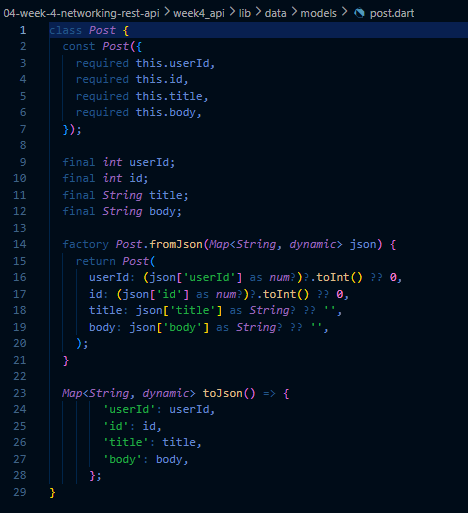

Mengapa cast defensif? Respons API nyata sering tidak sesuai dokumentasi (field hilang, tipe berubah). Pola as String? ?? '' mencegah crash type 'Null' is not a subtype yang menjadi sumber bug paling umum pada integrasi API pertama.

## 2. Konfigurasi Dio terpusat

Buat `lib/data/api_client.dart`. Seluruh konfigurasi jaringan (base URL, timeout, logging) hidup di satu tempat:

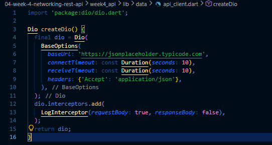

Mengapa Dio, bukan package http? Dio memberi timeout per-request, interceptor (logging/auth header), dan error terstruktur (DioException dengan type) tanpa boilerplate tambahan.

## 3. Repository sebagai pintu data

Buat `lib/data/repositories/post_repository.dart`:

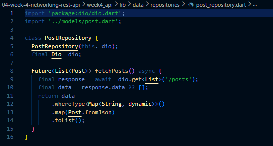

Perhatikan: repository tidak menampilkan UI apa pun dan tidak menangkap exception menjadi nilai diam-diam. Exception dibiarkan naik agar provider mengubahnya menjadi AsyncError secara otomatis di langkah berikutnya.

# Praktikum 2: Provider dan error handling

## 1. Provider AsyncNotifier + pesan error ramah pengguna

Buat `lib/data/providers.dart`. Provider mengubah exception teknis menjadi pesan yang bisa ditampilkan ke pengguna:

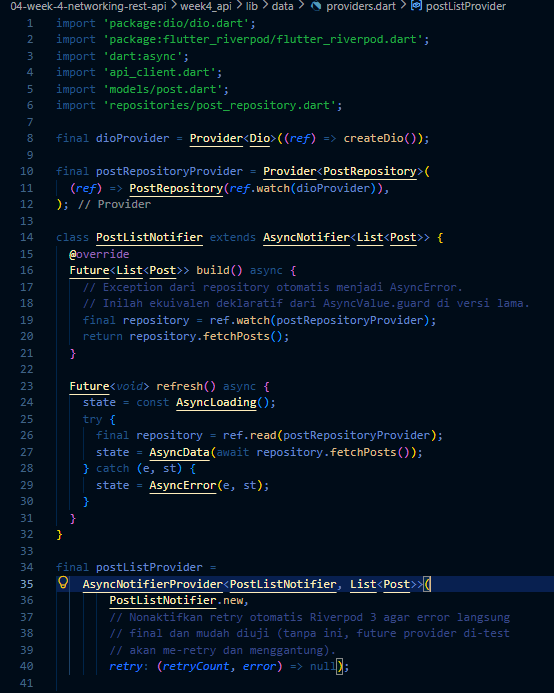

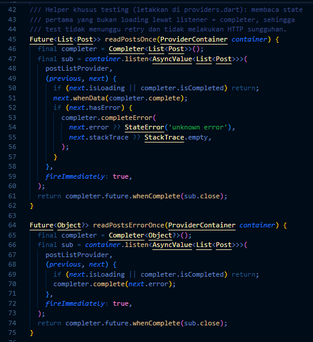

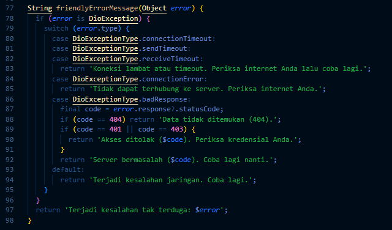

## 2. UI: loading, error, empty, success

Buat `lib/pages/post_list_page.dart`. Setiap state mendapat tampilannya sendiri:

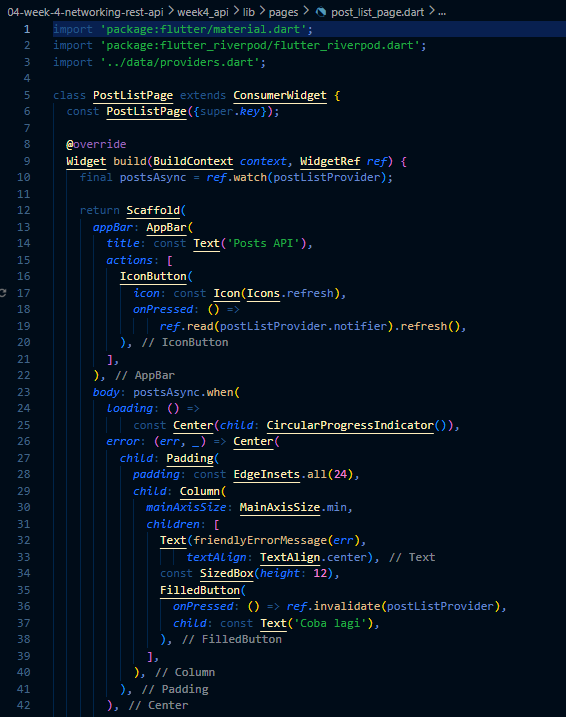


## 3. Entry point dengan ProviderScope

Isi `lib/main.dart`:

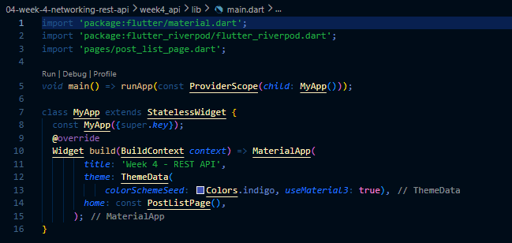

## Uji tiga skenario error

1. Jalankan aplikasi dengan internet normal, amati loading lalu daftar 100 posts.


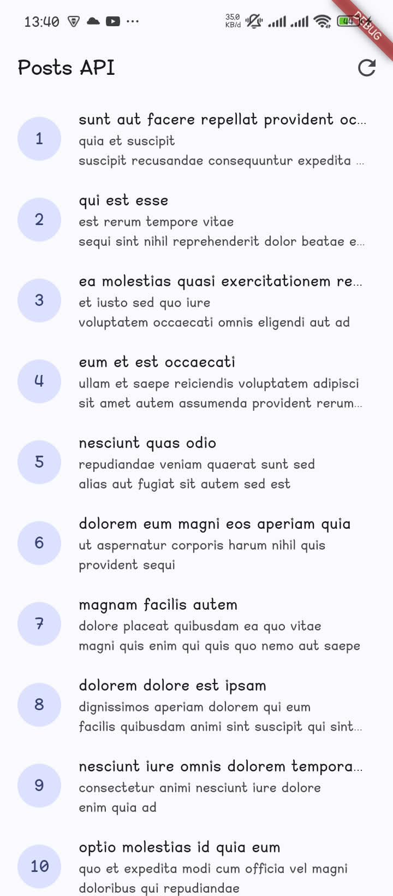

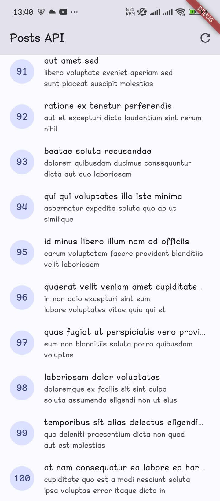

2. Matikan internet (mode pesawat), tekan refresh, amati pesan ramah + tombol Coba lagi. Nyalakan kembali internet, tekan Coba lagi.

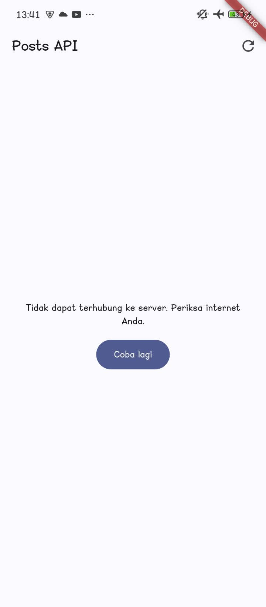

3. Sementara ubah baseUrl menjadi URL salah, amati pesan error koneksi. Kembalikan setelah uji.

```text
baseUrl: 'https://api.abc.example.com'
```

Output:


**Kesalahan umum (bahan ujian)**: memanggil Dio langsung dari widget; menelan exception dengan `catch` kosong; menampilkan pesan teknis mentah ke pengguna; lupa menangani empty state; tidak ada timeout sehingga UI menggantung selamanya.

# Praktikum 3: Pagination dasar

