| Key | Value |
|------|-----------------------|
| Nama | Robby Catur Wicaksono |
| NIM | 244107020048 |
| Kelas | TI - 3H |
| Mata Kuliah | Pemrograman Mobile |

# Praktikum 1: Dio dan model data

## 1. Model data dengan fromJson aman null

Buat `lib/data/models/post.dart`. API dummy yang dipakai minggu ini adalah JSONPlaceholder (gratis, tanpa API key) dengan endpoint `GET /posts`.


Mengapa cast defensif? Respons API nyata sering tidak sesuai dokumentasi (field hilang, tipe berubah). Pola as String? ?? '' mencegah crash type 'Null' is not a subtype yang menjadi sumber bug paling umum pada integrasi API pertama.

## 2. Konfigurasi Dio terpusat

Buat `lib/data/api_client.dart`. Seluruh konfigurasi jaringan (base URL, timeout, logging) hidup di satu tempat:


Mengapa Dio, bukan package http? Dio memberi timeout per-request, interceptor (logging/auth header), dan error terstruktur (DioException dengan type) tanpa boilerplate tambahan.

## 3. Repository sebagai pintu data

Buat `lib/data/repositories/post_repository.dart`:


Perhatikan: repository tidak menampilkan UI apa pun dan tidak menangkap exception menjadi nilai diam-diam. Exception dibiarkan naik agar provider mengubahnya menjadi AsyncError secara otomatis di langkah berikutnya.

# Praktikum 2: Provider dan error handling

## 1. Provider AsyncNotifier + pesan error ramah pengguna

Buat `lib/data/providers.dart`. Provider mengubah exception teknis menjadi pesan yang bisa ditampilkan ke pengguna:


## 2. UI: loading, error, empty, success

Buat `lib/pages/post_list_page.dart`. Setiap state mendapat tampilannya sendiri:


## 3. Entry point dengan ProviderScope

Isi `lib/main.dart`:


## Uji tiga skenario error

1. Jalankan aplikasi dengan internet normal, amati loading lalu daftar 100 posts.


2. Matikan internet (mode pesawat), tekan refresh, amati pesan ramah + tombol Coba lagi. Nyalakan kembali internet, tekan Coba lagi.


3. Sementara ubah baseUrl menjadi URL salah, amati pesan error koneksi. Kembalikan setelah uji.

```text
baseUrl: 'https://api.abc.example.com'
```

Output:


**Kesalahan umum (bahan ujian)**: memanggil Dio langsung dari widget; menelan exception dengan `catch` kosong; menampilkan pesan teknis mentah ke pengguna; lupa menangani empty state; tidak ada timeout sehingga UI menggantung selamanya.

# Praktikum 3: Pagination dasar

## Konsep pagination

API dengan data besar tidak dikirim sekaligus, melainkan per halaman. JSONPlaceholder mendukung query `?_page=N&_limit=M`. Strategi UI: _infinite scroll_, muat halaman berikut saat pengguna mendekati ujung list, tampilkan indikator kecil di bawah tanpa menghapus data lama.

## 1. Repository paginated

Tambahkan method berikut ke PostRepository:

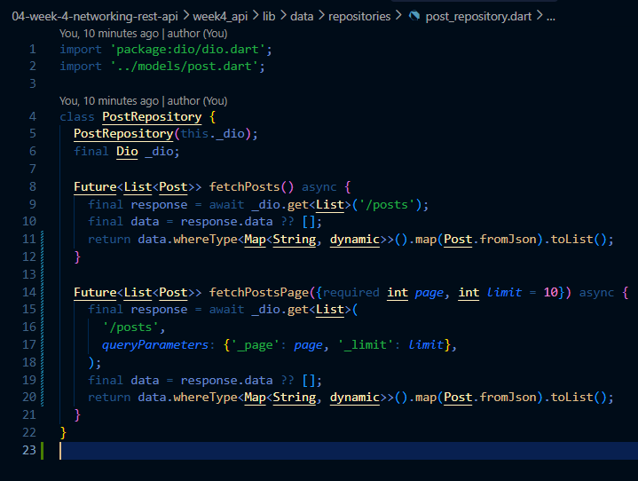

## 2. Notifier dengan state halaman

Lanjutkan `lib/data/paged_posts.dart` dengan notifier (guard ganda + data lama dipertahankan saat error):

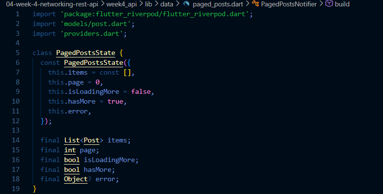

## 3. Notifier dengan state halaman (lanjutan)

Lanjutkan file `lib/data/paged_posts.dart` dengan notifier:

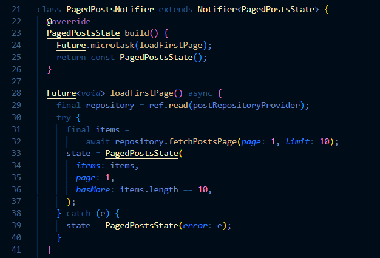

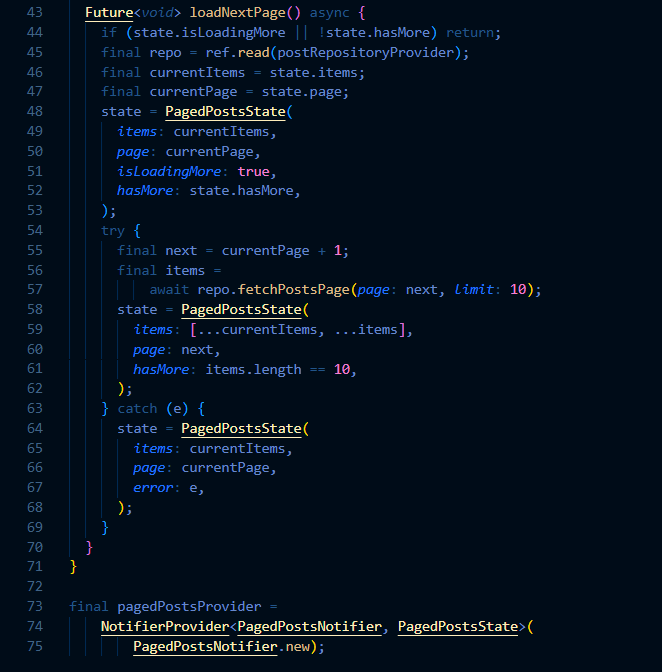

## 4. UI infinite scroll

Buat `lib/pages/paged_post_page.dart` dengan ScrollController yang memicu halaman berikut 200px sebelum ujung list:

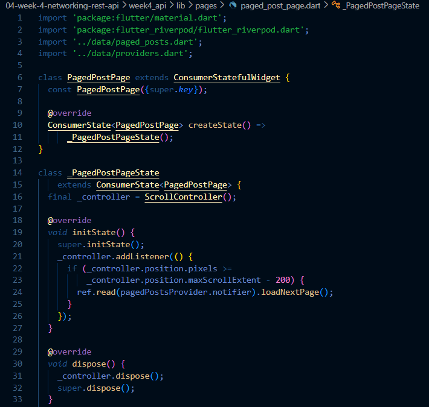

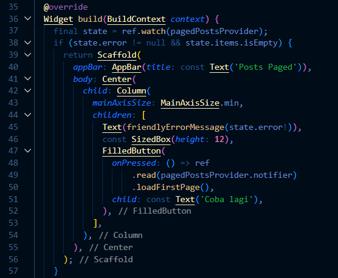

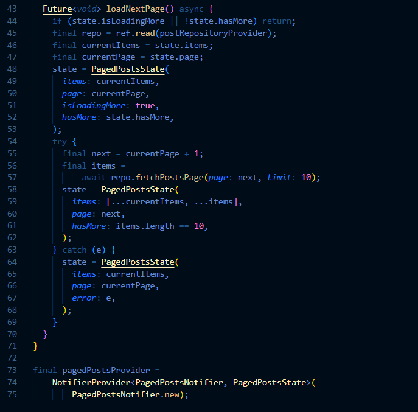

Ubah home di main.dart menjadi PagedPostPage, jalankan, dan scroll sampai bawah. Amati: halaman 1 tampil dulu, indikator muncul, data bertambah tanpa reload penuh.


# AI Challenge

## AI Prompt Challenge

Minta AI coding assistant (Cursor, Copilot, Claude Code, atau tool setara) dengan prompt berikut:

```text
Buatkan repository layer Flutter untuk endpoint GET /comments?postId={id}
dari JSONPlaceholder menggunakan Dio + flutter_riverpod.
Requirements:
- Model Comment dengan fromJson aman null (postId, id, name, email, body).
- CommentRepository dengan method fetchComments(postId) + timeout 10 detik.
- AsyncNotifierProvider dengan penanganan error otomatis (AsyncError)
  dan fungsi pesan error
  ramah pengguna untuk timeout, connection error, 404, dan 500.
- Satu unit test untuk fromJson dengan field yang hilang.
Jelaskan setiap bagian kode dalam komentar.
```

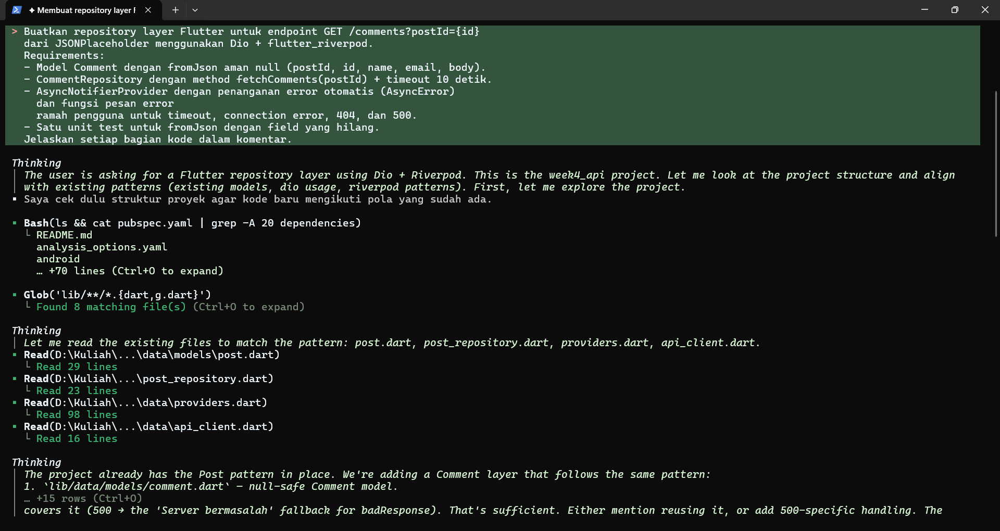

**Hasil:**

<table>
  <tr>
    <td>
    <p>10 Halaman Pertama</p>
    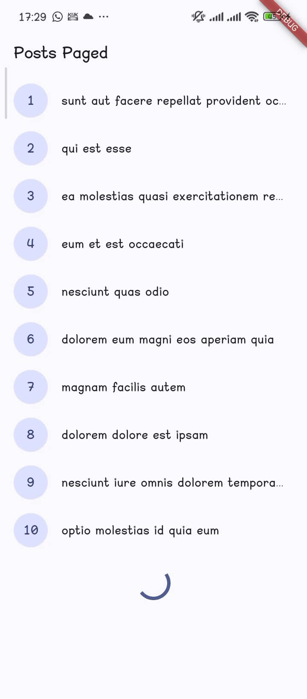
    </td>
    <td>
    <p>Halaman Pertama Setelah Terload</p>
    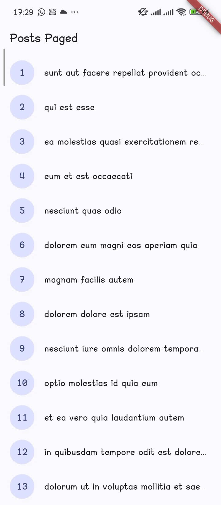
    </td>
    <td>
    <p>Seluruh Halaman</p>
    
    </td>
  </tr>
</table>

## Verifikasi hasil AI di device fisik

Hasil AI tidak dipercaya begitu saja. Layer Comment diverifikasi lewat unit test (2 test fromJson) dan test pesan error (4 test). Namun saat dijalankan di device fisik muncul bug yang tidak tertangkap test: list pagination stuck di 10 item dengan spinner/loading selamanya.

Akar masalah (hasil analisis bersama AI):

1. Error saat memuat halaman berikutnya ditelan diam-diam karena UI hanya
   menampilkan pesan error ketika list masih kosong.
2. Di layar tinggi (720x1640), 10 item + footer lebih pendek dari viewport
   sehingga `maxScrollExtent = 0` — list tidak bisa di-scroll dan listener
   scroll tidak pernah fires.

Perbaikan: state error disimpan bersama data (footer menampilkan pesan + tombol "Coba lagi"), dan posisi scroll di-check ulang setiap load selesai sehingga halaman berikutnya dimuat otomatis sampai layar terisi.

<table>
  <tr>
    <td>
    <p>Sebelum fix: fling tidak menambah data</p>
    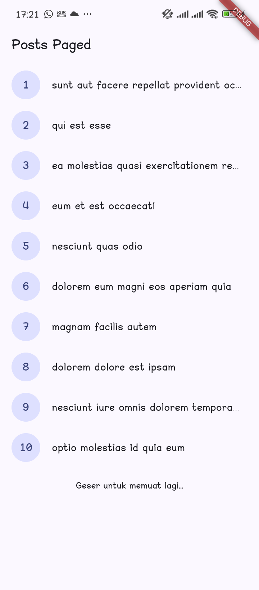
    </td>
    <td>
    <p>Sesudah fix: 20 item terisi otomatis</p>
    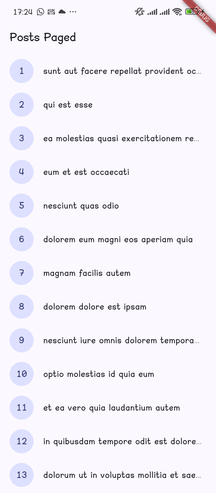
    </td>
    <td>
    <p>Akhir data: footer indikator muncul</p>
    
    </td>
  </tr>
</table>

Catatan verifikasi lengkap (termasuk koreksi atas kode hasil AI, mis. cast `as num?` yang masih crash dan `FamilyAsyncNotifier` yang tidak ada di Riverpod 3) didokumentasikan di `docs/verifikasi-ai-week4.md`.

# Refactoring dan testing

## Refactoring Challenge

Lakukan refactoring berikut pada project API Anda, lalu commit dengan pesan yang jelas:

### 1. Ekstrak widget baris post menjadi PostTile tersendiri agar ListView.builder pendek dan mudah diuji.

Buat `lib/widgets/post_tile.dart`. `ListView.builder` di halaman paged dan non-paged sebelumnya berisi `ListTile` inline yang duplikat. `PostTile` memiliki parameter `onTap` (navigasi) dan `showBody` (subtitle body untuk halaman non-paged), sehingga builder kedua halaman pendek dan tile bisa diuji sebagai widget tersendiri.

### 2. Pindahkan friendlyErrorMessage ke file lib/data/network_errors.dart agar bisa dipakai ulang halaman paged dan non-paged.

Pindahkan `friendlyErrorMessage` dari `providers.dart` ke `lib/data/network_errors.dart`. Fungsinya hanya butuh `DioException`, bukan provider, jadi letaknya terlepas dari lapisan state. Halaman paged, non-paged, dan detail semuanya mengimpor file yang sama.

### 3. Tambahkan halaman detail post dengan GoRouter (/post/:id) yang menampilkan title dan body lengkap, state detail diambil dari list yang sudah dimuat atau via repository bila langsung dibuka.

Tambah dependensi `go_router`, buat `lib/router.dart` dengan route `/` (daftar post) dan `/post/:id` (detail), ubah `main.dart` menjadi `MaterialApp.router`. Halaman detail `lib/pages/post_detail_page.dart` mengambil data secara berjenjang:

1. Cari di list yang sudah dimuat (`pagedPostsProvider`) → tampil instan, nol request baru saat user navigasi dari daftar.
2. Jika list masih dimuat, tunggu.
3. Jika dibuka langsung (deep link) dan post tidak ada di list → fetch via `PostRepository.fetchPost(id)` (GET /posts/:id) lewat `postDetailProvider` (FutureProvider.family).

### Hasil

`flutter analyze` tanpa issue dan `flutter test` lulus 12/12, termasuk test baru: klik tile membuka `/post/:id` dari cache (tanpa fetch), dan fallback repository saat post tidak ada di list.

## Testing: unit test model + mock repository

Buat `test/post_test.dart`, uji parsing aman null, mapping error, dan provider dengan repository palsu (tanpa internet):

```dart
class FakePostRepository extends PostRepository {
  FakePostRepository({this.items, this.throwError = false})
      : super(Dio());
  final List<Post>? items;
  final bool throwError;

  @override
  Future<List<Post>> fetchPosts() async {
    if (throwError) {
      throw DioException(
        requestOptions: RequestOptions(path: '/posts'),
        type: DioExceptionType.connectionError,
      );
    }
    return items ?? const [];
  }
}
```

## 2. Empat test

1. **Parsing aman null** — `Post.fromJson({'id': 7})`: field hilang diberi default (`title ''`, `userId 0`), tidak crash.
2. **Mapping error** — `DioException(connectionError)` → `friendlyErrorMessage` berisi kata "terhubung".
3. **Provider sukses** — `ProviderContainer` dengan `postRepositoryProvider.overrideWith((ref) => FakePostRepository(...))`, dibaca lewat helper `readPostsOnce`; hasilnya data dari repository palsu.
4. **Provider error** — repo palsu melempar error, `readPostsErrorOnce` menghasilkan `AsyncError` berisi `DioException`.

Catatan implementasi: setelah refactor, `friendlyErrorMessage` diimpor dari `lib/data/network_errors.dart` (bukan `providers.dart`), dan Riverpod 3 memakai `overrideWith((ref) => value)` untuk `Provider`.

## 3. Jalankan

```text
flutter analyze
flutter test
```

**Hasil:** analyze tanpa issue; `flutter test` lulus **16/16** (4 test baru di `post_test.dart` + 12 test sebelumnya). Pola override repository palsu ini adalah fondasi mock API yang dipakai lagi di Minggu 12 (Testing & QA).

# Tugas, refleksi, dan referensi

## Mini project / Industry Challenge

Aplikasi **"Posts Paged"** — daftar post dari JSONPlaceholder dengan infinite scroll dan halaman detail. Checklist ketentuan dan buktinya:

| Ketentuan | Bukti di project ini |
|---|---|
| Data API dummy via repository + Riverpod | `PostRepository` → `postListProvider`/`pagedPostsProvider`, UI hanya `ref.watch` |
| Dio terpusat (base URL, timeout, interceptor logging) | `lib/data/api_client.dart`: `baseUrl` jsonplaceholder, timeout 10s, `LogInterceptor` |
| Model `fromJson` aman null | `lib/data/models/post.dart` dan `comment.dart` (fallback `0`/`''`, tak pernah crash) |
| 4 state: loading, error (+retry), empty, success | `PostListPage` (`state.when`) dan `PagedPostPage` (flag `isLoadingFirst`, footer error + tombol "Coba lagi", "Belum ada data dari server.") |
| Pagination infinite scroll 10/halaman + guard request ganda | `PagedPostsNotifier`: guard `isLoadingMore/hasMore/items.isEmpty`; test membuktikan tiap halaman direquest tepat 1x |
| Minimal 2 test lulus | 16 test lulus: unit model, error mapping, provider dengan `FakePostRepository` (tanpa internet) |
| AI Challenge terdokumentasi | Prompt, hasil, koreksi, dan alasan teknis di bagian AI Challenge + `docs/verifikasi-ai-week4.md` |
| Struktur portfolio | `04-week-4-networking-rest-api/` dengan `lib/`, `test/`, `docs/`, `README.md`, `screenshots/` |

**Cara menjalankan:** `flutter pub get` → `flutter run` (device fisik) → `flutter test` untuk verifikasi.

**Stack:** Flutter (Material 3), Dart, Dio 5, flutter_riverpod 3 (`AsyncNotifier`, family), go_router (route `/post/:id`), flutter_test + `ProviderContainer` overrides.

## Refleksi

**1. Mengapa UI dilarang memanggil Dio langsung? Apa yang rusak jika dilanggar?**
Lapisan repository + provider membuat sumber data menjadi satu titik yang bisa diganti. Buktinya di test kita: `postRepositoryProvider.overrideWith((ref) => FakePostRepository())` membuat seluruh UI (list, pagination, detail) teruji tanpa satu pun request HTTP. Jika widget memanggil Dio langsung, yang rusak: (a) test widget harus menyentuh jaringan sungguhan atau mock di level HTTP yang jauh lebih ribet; (b) konfigurasi terpusat (timeout, base URL, interceptor auth) tidak berlaku — tiap halaman bikin `Dio()` sendiri; (c) perubahan API (endpoint, struktur respons) memaksa edit banyak widget, bukan satu repository; (d) logika caching/guard pagination jadi terkopi dan tidak konsisten antar halaman.

**2. Kapan pagination client-side cukup, dan kapan server (`_page`/`_limit`)?**
Client-side cukup bila seluruh dataset memang kecil dan relatif statis (ratusan item, mis. daftar kategori/mata kuliah) — data diambil sekali lalu `ListView` menampilkan per potong, keuntungan: filter/sort instan tanpa request baru. Server-side wajib ketika: total data bisa ribuan dan terus bertambah (hemat bandwidth dan memori HP), perlu urutan global yang selalu segar, atau backend sudah menyediakan endpoint paginated — seperti JSONPlaceholder `?_page=N&_limit=10` yang kita pakai. Rule of thumb: kalau "ambil semua dulu" terasa boros di atas ~1.000 item atau di jaringan seluler, pakai server-side.

**3. Bagaimana exception repository berubah menjadi `AsyncError` tanpa try/catch di widget? Kapan try/catch eksplisit tetap dibutuhkan?**
`AsyncNotifier.build()` mengembalikan `Future`. Riverpod menyimpan future itu di `AsyncValue`; ketika future reject, state otomatis berubah menjadi `AsyncError(error, stackTrace)` — widget tinggal `state.when(error: ...)`. Try/catch eksplisit tetap dibutuhkan saat: (a) state custom bukan `AsyncValue` — `PagedPostsNotifier` kami memakai `PagedPostsState` manual sehingga wajib `try/catch` untuk menyimpan error **bersama** data lama (ini persis bug "spinner abadi" di device: error halaman 2 tertangkap tapi tidak pernah ditampilkan); (b) ingin recover sebagian (log lalu lanjut, bukan tampilkan error); (c) `refresh()` yang harus mempertahankan `state` lama sambil memuat ulang; (d) mengonversi error menjadi nilai default (`fallback`) alih-alih status error.

**4. Bagian mana dari hasil AI yang Anda perbaiki, dan mengapa?**
Empat hal, semuanya lewat verifikasi (test/analyze/device fisik):
- `Comment.fromJson` versi pertama memakai `(json['x'] as num?)?.toInt() ?? 0` yang masih crash saat field bertipe salah (angka dikirim sebagai string). Unit test saya menangkap `TypeError`; diganti helper defensif `_asInt`/`_asString`.
- AI memakai `FamilyAsyncNotifier` yang tidak ada di Riverpod 3. `flutter analyze` menolak; diperbaiki menjadi konstruktor `CommentListNotifier(this.postId)`.
- Perbaikan pagination pertama AI tidak menyelesaikan gejala di device fisik: di layar tinggi 720x1640, 10 item + footer lebih pendek dari viewport sehingga `maxScrollExtent = 0` dan listener scroll tidak pernah fires. Tertangkap hanya dengan menjalankan app di device, lalu ditambah re-check posisi otomatis setiap load selesai.
- `widget_test.dart` bawaan template (counter) sudah tidak relevan dan selalu gagal. Diganti smoke test pagination yang menguji 4 state lewat repository palsu.